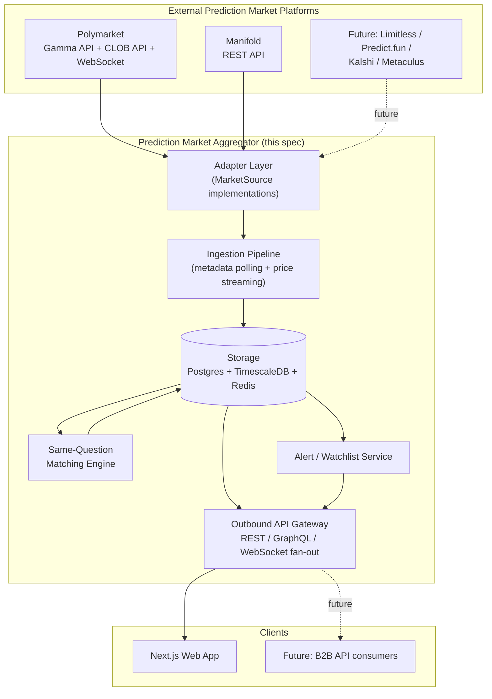
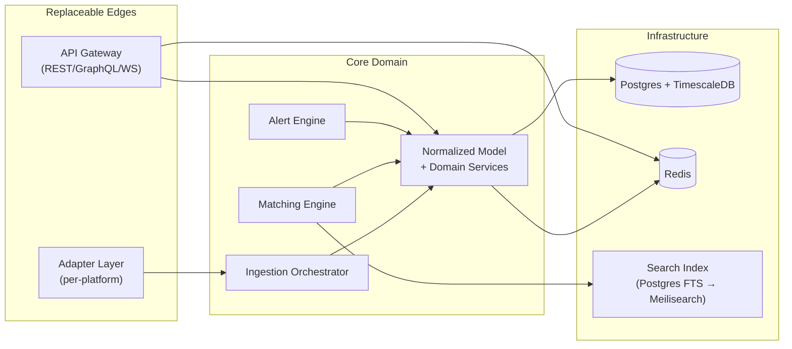
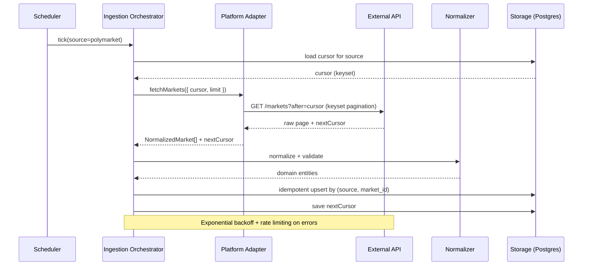
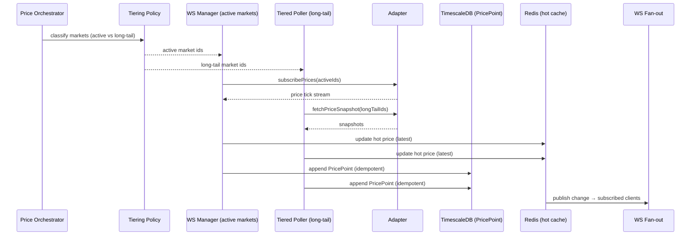
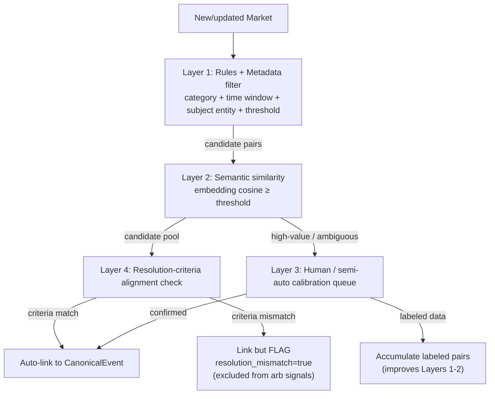
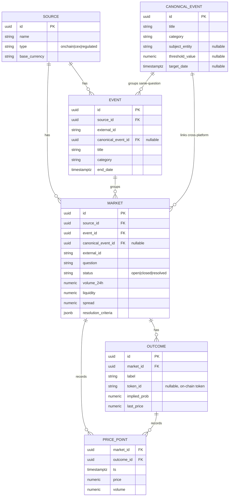

# Design Document: Prediction Market Aggregator

## Overview

The Prediction Market Aggregator is an independent, **read-only** comparison dashboard and data service that unifies prediction markets across multiple platforms (starting with Polymarket, Manifold, and Predict.fun). Its core value is a normalized cross-platform data model that lets users discover the same real-world question across venues, compare implied probabilities side by side, and surface the largest price gaps as **display-only** signals.

Strategically, v1 is a *data moat + smart funnel*. It deliberately stops short of regulated activity (no order placement, no fund routing, no execution). The "Go trade" action in v1 is a deep-link out to the source platform — but the architecture reserves that exact slot for a future "one-click participate" flow backed by the operator's own wallet/exchange. Every architectural decision (the adapter layer, the normalized schema, the outbound API gateway) is made so that later phases can plug in execution **without a rewrite**.

This document covers both **high-level design** (system context, component breakdown, data-flow, normalized data model) and **low-level design** (the `MarketSource` adapter interface, the ingestion pipeline algorithms, the same-question matching engine, the outbound API surface, and the storage schemas). The codebase targets an open-source release on GitHub, so the design favors clear module boundaries, a clean extensible adapter layer, and strong separation of concerns. Code examples are written in **TypeScript** (the prompt specifies a Next.js frontend and TypeScript-style interface sketches).

### Goals

- Unified market discovery across platforms with normalized probability, volume, liquidity, and time-to-resolution.
- Same-question comparison view across platforms (the key differentiator).
- Price-gap / arbitrage signals — **display only**, with resolution-criteria mismatch flagging to avoid false signals.
- Market detail with price-history curves, depth, and recent trades.
- Watchlist + movement alerts (threshold crossings, spread widening).
- Outbound "Go trade" deep-links (the future execution slot).

### Non-Goals (v1)

- Order placement, fund routing, cross-platform hedging/arbitrage execution (all regulated, deferred).
- Region-specific compliance/geofencing logic for trade routing (designed-for, not implemented).
- Adapters beyond Polymarket, Manifold, and Predict.fun (interface designed for them; not implemented).

---

## Architecture

### System Context



### Layered Architecture

The system is organized into clear, independently testable layers. Dependencies point inward toward the core domain (normalized model); the adapter layer and API layer are the replaceable edges.



### Module / Repository Layout (open-source friendly)

```text
prediction-market-aggregator/
├── packages/
│   ├── core/                # Normalized domain model, types, value objects (no I/O)
│   │   ├── src/model/       # Source, Event, Market, Outcome, PricePoint, CanonicalEvent
│   │   ├── src/ports/       # MarketSource interface + repository interfaces
│   │   └── src/services/    # Domain services (spread calc, normalization helpers)
│   ├── adapters/            # One folder per platform; depends only on core/ports
│   │   ├── polymarket/
│   │   ├── manifold/
│   │   └── README.md        # "How to write a new adapter" guide
│   ├── ingestion/           # Orchestrator, schedulers, pollers, WS managers, upsert writers
│   ├── matching/            # Same-question matching engine (rules → embeddings → calibration)
│   ├── storage/             # Postgres/TimescaleDB repos, Redis cache, migrations
│   ├── api/                 # REST + GraphQL + WebSocket fan-out gateway
│   └── alerts/              # Watchlist + movement alert engine
├── apps/
│   └── web/                 # Next.js frontend (Recharts / lightweight-charts)
├── docs/                    # Architecture docs, adapter authoring guide, data model
└── docker-compose.yml       # Postgres+TimescaleDB, Redis, app services for local dev
```

The dependency rule: `adapters/*` and `api/` depend on `core/`; `core/` depends on nothing external. This keeps the domain pure and makes adding a platform a localized change (one new folder under `adapters/`).

---

## Data Flow

### Metadata Ingestion Flow (incremental polling)



### Price Streaming Flow (WebSocket + tiered polling)



### Same-Question Matching Flow



---

## Components and Interfaces

### Component 1: Adapter Layer (`MarketSource`)

**Purpose**: Isolate every platform-specific concern (auth, endpoints, pagination, rate limits, payload shape, WebSocket protocol) behind one uniform interface. Adding a platform = implementing this interface in a new folder. The rest of the system never imports platform SDKs.

**Responsibilities**:
- Fetch events and markets with keyset pagination.
- Provide price snapshots (pull) and a price subscription (push) where available.
- Normalize raw payloads into core domain entities.
- Declare its own capabilities (does it support WebSocket? historical prices? order-book depth?) so the orchestrator can adapt.

**Interface** (see Low-Level Design for full signatures):
```typescript
interface MarketSource {
  readonly meta: SourceMeta;
  fetchEvents(opts: PageRequest): Promise<Page<NormalizedEvent>>;
  fetchMarkets(opts: PageRequest): Promise<Page<NormalizedMarket>>;
  fetchPriceSnapshot(marketIds: string[]): Promise<NormalizedPriceSnapshot[]>;
  fetchPriceHistory(marketId: string, range: TimeRange): Promise<NormalizedPricePoint[]>;
  subscribePrices?(marketIds: string[], handler: PriceTickHandler): Subscription;
  capabilities(): SourceCapabilities;
}
```

### Component 2: Ingestion Pipeline

**Purpose**: Orchestrate polling and streaming across all registered adapters, write idempotently, and stay resilient under upstream failure.

**Responsibilities**:
- Schedule metadata polls per source with keyset cursors.
- Maintain a tiering policy: WebSocket for active markets, tiered polling for long-tail.
- Apply rate limiting, exponential backoff, and reconnect-with-backfill.
- Perform idempotent upserts keyed on `(source_id, external_id)`.

### Component 3: Same-Question Matching Engine

**Purpose**: Group markets from different platforms that represent the same real-world question into a `CanonicalEvent`, and flag resolution-criteria mismatches so the product never emits a false arbitrage signal.

**Responsibilities**:
- Layer 1: rule/metadata pre-filter (category, time window, subject entity, threshold number).
- Layer 2: embedding similarity on question text.
- Layer 3: human/semi-auto calibration queue + labeled-data accumulation.
- Layer 4: resolution-criteria alignment; tag mismatches.

### Component 4: Storage Layer

**Purpose**: Persist normalized relational metadata and price time-series, plus a hot cache.

**Responsibilities**:
- Postgres for relational metadata; TimescaleDB hypertable for `price_point`.
- Redis for hot latest-price cache and WS fan-out pub/sub.
- Full-text search on Postgres initially (pluggable to Meilisearch later).

### Component 5: Outbound API Gateway

**Purpose**: Expose the project's *own* REST + GraphQL + WebSocket so the frontend never talks to upstream APIs. Unifies rate limiting, shields upstream differences, and is the future B2B surface.

**Responsibilities**:
- REST/GraphQL read endpoints for discovery, comparison, detail, signals.
- WebSocket fan-out of live price/spread updates.
- Watchlist + alert subscription endpoints.

### Component 6: Alert / Watchlist Service

**Purpose**: Let users track markets/canonical events and receive notifications on probability threshold crossings or spread widening.

**Responsibilities**:
- Persist watchlists and alert rules.
- Evaluate rules against incoming price updates.
- Dispatch notifications via the API gateway (and pluggable channels later).

---

## Data Models

The normalized schema is the core asset. It is platform-agnostic: each adapter maps its raw payload into these entities. `external_id` always stores the platform's native identifier; the pair `(source_id, external_id)` is the idempotency key.

### Entity-Relationship Overview



### Model Definitions (domain types)

```typescript
type SourceType = "onchain" | "cex" | "regulated";

interface Source {
  id: string;            // internal UUID
  name: string;          // "Polymarket", "Manifold"
  type: SourceType;
  baseCurrency: string;  // "USDC", "MANA"
}

interface Event {
  id: string;
  sourceId: string;
  externalId: string;          // platform-native event id
  canonicalEventId: string | null;
  title: string;
  category: Category;
  endDate: string | null;      // ISO 8601
}

interface Market {
  id: string;
  sourceId: string;
  eventId: string | null;
  canonicalEventId: string | null;
  externalId: string;          // platform-native market id (idempotency: source+external)
  question: string;
  status: "open" | "closed" | "resolved";
  volume24h: number | null;
  liquidity: number | null;
  spread: number | null;       // best-ask minus best-bid on the Yes outcome
  resolutionCriteria: ResolutionCriteria;
}

interface Outcome {
  id: string;
  marketId: string;
  label: string;               // "Yes" / "No" / candidate name
  tokenId: string | null;      // on-chain outcome token (Polymarket); null off-chain
  impliedProb: number | null;  // 0..1
  lastPrice: number | null;    // 0..1 for binary
}

interface PricePoint {         // TimescaleDB hypertable row
  marketId: string;
  outcomeId: string;
  ts: string;                  // ISO 8601, hypertable time dimension
  price: number;
  volume: number | null;
}

interface CanonicalEvent {
  id: string;
  title: string;
  category: Category;
  subjectEntity: string | null;   // "BTC", candidate name — used by matching Layer 1
  thresholdValue: number | null;  // extracted numeric threshold, e.g. 100000
  targetDate: string | null;
}

type Category = "politics" | "crypto" | "sports" | "economics" | "tech" | "other";

interface ResolutionCriteria {
  dataSource: string | null;   // e.g. "CoinGecko close", "AP race call"
  cutoffTime: string | null;   // ISO 8601 settlement cutoff
  rounding: string | null;     // platform rounding rule description
  raw: Record<string, unknown>;// preserved raw criteria for auditability
}
```

**Validation Rules**:
- `(sourceId, externalId)` is unique per entity type (idempotency key).
- `impliedProb` and binary `lastPrice` must be within `[0, 1]`.
- For a binary market, outcome implied probabilities should sum to ≈ 1 (within tolerance); deviations are normalized and logged.
- `spread` must be `>= 0`.
- `canonicalEventId` is nullable; a market is comparable cross-platform only once linked.
- `resolutionCriteria.raw` is always preserved even when structured fields are null (auditability for matching Layer 4).

---

## Low-Level Design

### The `MarketSource` Adapter Interface

This is the foundational extension point. Each platform implements it; nothing else in the system knows platform-specific details. Optional methods are gated by `capabilities()` so the orchestrator degrades gracefully (e.g., Manifold has no native WebSocket → fall back to polling).

```typescript
// packages/core/src/ports/market-source.ts

interface SourceMeta {
  id: string;          // internal source UUID (resolved at registration)
  key: string;         // stable slug: "polymarket" | "manifold"
  name: string;
  type: SourceType;    // "onchain" | "cex" | "regulated"
  baseCurrency: string;
}

interface SourceCapabilities {
  websocketPrices: boolean;   // true: subscribePrices is implemented
  priceHistory: boolean;      // true: fetchPriceHistory is supported
  orderBookDepth: boolean;    // true: depth available (e.g. Polymarket CLOB)
  keysetPagination: boolean;  // true: cursor-based; false: offset fallback
}

interface PageRequest {
  cursor?: string;     // opaque keyset cursor; undefined = start
  limit: number;       // page size requested
  updatedSince?: string; // ISO 8601, for incremental metadata sync
}

interface Page<T> {
  items: T[];
  nextCursor: string | null; // null = end of stream for this sync window
}

interface TimeRange {
  from: string;        // ISO 8601
  to: string;          // ISO 8601
  interval?: "1m" | "5m" | "1h" | "1d";
}

// Raw-normalized payloads (already mapped to domain shape, not yet persisted)
interface NormalizedEvent {
  externalId: string;
  title: string;
  category: Category;
  endDate: string | null;
  rawResolution?: Record<string, unknown>;
}

interface NormalizedMarket {
  externalId: string;
  eventExternalId: string | null;
  question: string;
  status: "open" | "closed" | "resolved";
  volume24h: number | null;
  liquidity: number | null;
  spread: number | null;
  outcomes: NormalizedOutcome[];
  resolutionCriteria: ResolutionCriteria;
}

interface NormalizedOutcome {
  label: string;
  tokenId: string | null;
  impliedProb: number | null;
  lastPrice: number | null;
}

interface NormalizedPriceSnapshot {
  marketExternalId: string;
  outcomeLabel: string;
  price: number;       // 0..1 for binary
  volume: number | null;
  ts: string;          // ISO 8601 capture time
}

type NormalizedPricePoint = NormalizedPriceSnapshot;

type PriceTickHandler = (tick: NormalizedPriceSnapshot) => void;

interface Subscription {
  close(): void;
  readonly isOpen: boolean;
}

interface MarketSource {
  readonly meta: SourceMeta;

  // Metadata sync (keyset pagination, incremental via updatedSince)
  fetchEvents(opts: PageRequest): Promise<Page<NormalizedEvent>>;
  fetchMarkets(opts: PageRequest): Promise<Page<NormalizedMarket>>;

  // Prices — pull
  fetchPriceSnapshot(marketIds: string[]): Promise<NormalizedPriceSnapshot[]>;
  fetchPriceHistory(marketId: string, range: TimeRange): Promise<NormalizedPricePoint[]>;

  // Prices — push (optional; present only if capabilities().websocketPrices)
  subscribePrices?(marketIds: string[], handler: PriceTickHandler): Subscription;

  capabilities(): SourceCapabilities;
}
```

**Polymarket adapter notes**: `fetchEvents`/`fetchMarkets` read from the Gamma API (`gamma-api.polymarket.com`, no auth) — smallest unit is a binary Yes/No market = two Polygon outcome tokens; implied probability = price of the Yes token. `fetchPriceSnapshot`/`fetchPriceHistory` and `orderBookDepth` use the CLOB API (`clob.polymarket.com`). `subscribePrices` uses the WebSocket market channel. `capabilities` → all `true`.

**Manifold adapter notes**: REST only. `capabilities().websocketPrices = false` → orchestrator routes all Manifold markets through tiered polling. Recommended as the second adapter precisely to prove normalization and same-question matching without relying on WebSocket.

**Predict.fun adapter notes**: REST only (`api.predict.fun` mainnet, requires an `x-api-key` header; `api-testnet.predict.fun` is public). Predict.fun is the BNB-Chain prediction market that is the official predictions provider integrated into Binance Wallet; it is an on-chain CLOB venue (`type: "onchain"`, `baseCurrency: "USDB"`) whose binary Yes/No share prices read directly as implied probability. `fetchMarkets` reads `GET /v1/markets` (cursor-paginated `{ data, cursor }`); the markets list carries no live price, so metadata outcomes carry an explicit `null` probability (Req 1.5). `fetchPriceSnapshot` reads `GET /v1/markets/{id}/orderbook` and takes the **best-bid/ask mid as the Yes implied probability**; `fetchPriceHistory` reads `GET /v1/markets/{id}/timeseries`; `fetchOrderBookDepth` exposes the CLOB ladders. `capabilities` → `websocketPrices: false` (the public read API has no price socket → tiered polling), `priceHistory`/`orderBookDepth`/`keysetPagination: true`. v1 never touches the authenticated order-placement endpoints (Req 12.1).

#### Adapter registration

```typescript
// packages/ingestion/src/registry.ts
interface AdapterRegistry {
  register(source: MarketSource): void;
  all(): MarketSource[];
  byKey(key: string): MarketSource | undefined;
}
// Adding a platform = register(new XAdapter()). Zero changes elsewhere.
```

### Ingestion Pipeline Algorithms

#### Metadata incremental sync (keyset pagination + idempotent upsert)

```typescript
function syncMarkets(source: MarketSource, repo: MarketRepository): Promise<SyncResult>
```

**Preconditions:**
- `source` is registered and `source.meta.id` is resolved.
- `repo` exposes `loadCursor(sourceId)`, `upsertMarket(...)`, `saveCursor(...)`.

**Postconditions:**
- Every market returned within the sync window is upserted by `(source_id, external_id)`.
- The cursor is advanced and persisted only after the page is durably written.
- The operation is idempotent: re-running with the same upstream state produces no duplicate rows and no net change.

**Loop invariant:** after processing page *k*, all markets in pages `0..k` are persisted and `cursor` points at the boundary after page *k*.

```pascal
ALGORITHM syncMarkets(source, repo)
BEGIN
  cursor ← repo.loadCursor(source.meta.id)
  REPEAT
    page ← withRetry(source.fetchMarkets({ cursor, limit: PAGE_SIZE }))
    FOR each m IN page.items DO
      entity ← normalizeAndValidate(m, source.meta.id)
      // idempotent: ON CONFLICT (source_id, external_id) DO UPDATE
      repo.upsertMarket(entity)
      enqueueForMatching(entity)   // feed the matching engine
    END FOR
    cursor ← page.nextCursor
    repo.saveCursor(source.meta.id, cursor)   // durable only after writes
  UNTIL cursor = NULL
  RETURN SyncResult(processed, source.meta.key)
END
```

#### Resilient fetch wrapper (rate limit + exponential backoff)

```pascal
ALGORITHM withRetry(operation)
INPUT: operation (async fetch returning a page)
OUTPUT: page, or throws after MAX_ATTEMPTS
BEGIN
  attempt ← 0
  WHILE attempt < MAX_ATTEMPTS DO
    rateLimiter.acquire(source.meta.key)   // token bucket per source
    TRY
      RETURN await operation()
    CATCH err
      IF NOT isRetryable(err) THEN THROW err END IF
      delay ← min(BASE_DELAY * 2^attempt, MAX_DELAY) + jitter()
      sleep(delay)
      attempt ← attempt + 1
    END TRY
  END WHILE
  THROW MaxRetriesExceeded
END
```

**Postconditions:** transient errors (429, 5xx, network) are retried with exponentially increasing, jittered delays bounded by `MAX_DELAY`; non-retryable errors (4xx other than 429) propagate immediately.

#### Price tiering + WebSocket reconnect with backfill

```typescript
function classifyTier(market: Market, now: Date): "active" | "longTail"
```

A market is **active** if its event ends soon, or recent volume/trade frequency is above a tier threshold; otherwise **longTail**. Active markets stream over WebSocket (when `capabilities().websocketPrices`); long-tail markets are polled on a slower cadence.

```pascal
ALGORITHM managePriceStream(source, activeIds)
BEGIN
  IF NOT source.capabilities().websocketPrices THEN
    schedulePolling(source, activeIds, INTERVAL_ACTIVE)   // fallback (e.g. Manifold)
    RETURN
  END IF

  sub ← source.subscribePrices(activeIds, onTick)
  lastSeenTs ← now()

  ON disconnect:
    backoffReconnect()                        // exponential backoff
    sub ← source.subscribePrices(activeIds, onTick)
    // backfill the gap so the price curve has no holes
    FOR each id IN activeIds DO
      gap ← source.fetchPriceHistory(id, { from: lastSeenTs, to: now() })
      FOR each p IN gap DO writePricePoint(p) END FOR
    END FOR
END

PROCEDURE onTick(tick)
BEGIN
  redis.setHotPrice(tick.marketExternalId, tick.outcomeLabel, tick.price)  // hot cache
  writePricePoint(tick)                                                    // idempotent append
  fanout.publish(channelFor(tick.marketExternalId), tick)                  // WS fan-out
  lastSeenTs ← tick.ts
END
```

**Idempotent price write:** `writePricePoint` upserts on `(market_id, outcome_id, ts)` so reconnect backfill never duplicates points.

### Same-Question Matching Engine

The engine links cross-platform markets to a shared `CanonicalEvent`. It is layered easy→hard; each layer narrows candidates for the next. Layer 4 is mandatory before any pair contributes to a spread/arbitrage signal.

```typescript
function matchMarket(candidate: Market): MatchDecision
```

**Preconditions:** `candidate` is persisted; its category, question text, and `resolutionCriteria` are available.

**Postconditions:**
- If a confident match is found and resolution criteria align → `candidate.canonicalEventId` is set and the pair is **eligible** for spread signals.
- If matched but resolution criteria differ → linked with `resolutionMismatch = true` and **excluded** from arbitrage/spread signals.
- If ambiguous/high-value → routed to the human calibration queue; no auto-link.

```pascal
ALGORITHM matchMarket(candidate)
BEGIN
  // Layer 1 — rules + metadata pre-filter
  pool ← repo.findCandidates({
            category: candidate.category,
            timeWindow: around(candidate.endDate),
            subjectEntity: extractEntity(candidate.question),
            threshold: extractThreshold(candidate.question)
          })
  IF pool is empty THEN RETURN NoMatch END IF

  // Layer 2 — semantic similarity on question text
  qVec ← embed(candidate.question)
  scored ← []
  FOR each other IN pool DO
    sim ← cosine(qVec, embed(other.question))
    IF sim ≥ SIM_THRESHOLD THEN scored.add((other, sim)) END IF
  END FOR
  IF scored is empty THEN RETURN NoMatch END IF

  best ← argmax(scored by sim)

  // Layer 3 — calibration gate for ambiguous / high-value pairs
  IF best.sim < AUTO_CONFIRM_THRESHOLD OR isHighValue(candidate, best) THEN
    calibrationQueue.enqueue(candidate, best)
    RETURN PendingCalibration
  END IF

  // Layer 4 — resolution-criteria alignment (mandatory before signals)
  IF criteriaAligned(candidate.resolutionCriteria, best.market.resolutionCriteria) THEN
    canonical ← repo.linkToCanonical(candidate, best.market, mismatch=false)
    RETURN Matched(canonical, eligibleForSignals=true)
  ELSE
    canonical ← repo.linkToCanonical(candidate, best.market, mismatch=true)
    RETURN Matched(canonical, eligibleForSignals=false)   // flagged, no false arb
  END IF
END
```

**`criteriaAligned`** compares `dataSource`, `cutoffTime` (within tolerance), and `rounding`. Any material divergence → not aligned → mismatch flag. This is the guard that prevents **false arbitrage signals**.

**Calibration feedback loop:** confirmed/rejected pairs from Layer 3 are stored as labeled data, which tunes `SIM_THRESHOLD`, entity/threshold extraction rules, and (later) a learned matcher.

#### Spread / signal computation (display-only)

```typescript
function computeSignals(canonicalEventId: string): SpreadSignal[]
```

**Postconditions:** returns spreads only across markets where `resolutionMismatch = false` and `status = open`; each signal carries the per-platform implied probabilities, the max gap, and an explicit `executable: false` flag (v1 is display-only).

```pascal
ALGORITHM computeSignals(canonicalEventId)
BEGIN
  markets ← repo.marketsForCanonical(canonicalEventId)
             .filter(m → m.status = "open" AND NOT m.resolutionMismatch)
  IF count(markets) < 2 THEN RETURN [] END IF
  probs ← [ (m.source, yesOutcome(m).impliedProb) FOR m IN markets ]
  gap ← max(probs.value) - min(probs.value)
  RETURN [ SpreadSignal(canonicalEventId, probs, gap, executable=false) ]
END
```

### Outbound API Surface

The gateway is the only thing the frontend talks to. It exposes REST + GraphQL for reads and a WebSocket channel for live updates. All upstream differences are hidden; rate limiting is unified here.

#### REST endpoints (read-only in v1)

```text
GET  /api/markets                     # discovery: filter by category, q (search), status, sort
GET  /api/markets/{id}                # market detail + outcomes + latest prices
GET  /api/markets/{id}/history        # price history curve (range, interval)
GET  /api/canonical-events            # cross-platform groupings; filter by category
GET  /api/canonical-events/{id}       # same-question comparison view (per-platform side by side)
GET  /api/signals                     # largest cross-platform spreads (display-only, mismatch-filtered)
GET  /api/sources                     # registered platforms + capabilities

# Watchlist & alerts (authenticated user)
GET    /api/watchlist
POST   /api/watchlist                 # { targetType: "market"|"canonicalEvent", targetId }
DELETE /api/watchlist/{itemId}
POST   /api/alerts                    # { targetId, rule: thresholdCross|spreadWiden, params }
GET    /api/alerts
DELETE /api/alerts/{alertId}

# Outbound deep-link (future "one-click participate" slot)
GET  /api/markets/{id}/trade-link     # returns source platform deep-link (v1) 
```

```typescript
// Representative response contracts
interface MarketSummary {
  id: string;
  source: { key: string; name: string };
  question: string;
  category: Category;
  impliedProb: number | null;   // Yes-outcome probability 0..1
  volume24h: number | null;
  liquidity: number | null;
  timeRemainingSec: number | null;
  canonicalEventId: string | null;
}

interface ComparisonView {
  canonicalEvent: CanonicalEvent;
  rows: Array<{
    source: { key: string; name: string };
    marketId: string;
    impliedProb: number | null;
    volume24h: number | null;
    resolutionMismatch: boolean;   // surfaced to UI so users see why a row is excluded
    tradeLink: string;             // deep-link out (future execution slot)
  }>;
  maxSpread: number | null;        // computed over non-mismatch rows only
}

interface SpreadSignal {
  canonicalEventId: string;
  title: string;
  perPlatform: Array<{ source: string; impliedProb: number }>;
  gap: number;                     // max - min
  executable: false;               // v1 is display-only
}
```

#### WebSocket fan-out

```text
WS /ws
  → subscribe   { channel: "market", id }        # live price ticks for a market
  → subscribe   { channel: "canonical", id }     # live spread updates for a grouping
  → subscribe   { channel: "alerts" }            # user alert notifications
  ← message     { channel, type: "price"|"spread"|"alert", payload }
```

The fan-out is fed by Redis pub/sub from the ingestion `onTick` path, so clients receive updates without ever connecting to upstream platforms.

### Storage Schemas

Postgres holds relational metadata; the `price_point` table is a TimescaleDB hypertable; Redis holds the hot latest-price cache and pub/sub.

```sql
-- packages/storage/migrations/001_core.sql

CREATE TABLE source (
  id            UUID PRIMARY KEY DEFAULT gen_random_uuid(),
  key           TEXT NOT NULL UNIQUE,            -- "polymarket" | "manifold"
  name          TEXT NOT NULL,
  type          TEXT NOT NULL CHECK (type IN ('onchain','cex','regulated')),
  base_currency TEXT NOT NULL
);

CREATE TABLE canonical_event (
  id             UUID PRIMARY KEY DEFAULT gen_random_uuid(),
  title          TEXT NOT NULL,
  category       TEXT NOT NULL,
  subject_entity TEXT,
  threshold_value NUMERIC,
  target_date    TIMESTAMPTZ
);

CREATE TABLE event (
  id                 UUID PRIMARY KEY DEFAULT gen_random_uuid(),
  source_id          UUID NOT NULL REFERENCES source(id),
  external_id        TEXT NOT NULL,
  canonical_event_id UUID REFERENCES canonical_event(id),
  title              TEXT NOT NULL,
  category           TEXT NOT NULL,
  end_date           TIMESTAMPTZ,
  UNIQUE (source_id, external_id)                -- idempotency key
);

CREATE TABLE market (
  id                  UUID PRIMARY KEY DEFAULT gen_random_uuid(),
  source_id           UUID NOT NULL REFERENCES source(id),
  event_id            UUID REFERENCES event(id),
  canonical_event_id  UUID REFERENCES canonical_event(id),
  external_id         TEXT NOT NULL,
  question            TEXT NOT NULL,
  status              TEXT NOT NULL CHECK (status IN ('open','closed','resolved')),
  volume_24h          NUMERIC,
  liquidity           NUMERIC,
  spread              NUMERIC CHECK (spread >= 0),
  resolution_criteria JSONB NOT NULL DEFAULT '{}'::jsonb,
  resolution_mismatch BOOLEAN NOT NULL DEFAULT FALSE,   -- set by matching Layer 4
  updated_at          TIMESTAMPTZ NOT NULL DEFAULT now(),
  UNIQUE (source_id, external_id)                       -- idempotency key
);
CREATE INDEX idx_market_canonical ON market(canonical_event_id);
CREATE INDEX idx_market_category_status ON market(category_status_placeholder); -- see note
CREATE INDEX idx_market_question_fts ON market USING GIN (to_tsvector('english', question));

CREATE TABLE outcome (
  id           UUID PRIMARY KEY DEFAULT gen_random_uuid(),
  market_id    UUID NOT NULL REFERENCES market(id) ON DELETE CASCADE,
  label        TEXT NOT NULL,
  token_id     TEXT,                              -- on-chain outcome token; null off-chain
  implied_prob NUMERIC CHECK (implied_prob BETWEEN 0 AND 1),
  last_price   NUMERIC CHECK (last_price BETWEEN 0 AND 1),
  UNIQUE (market_id, label)
);

-- TimescaleDB hypertable for time-series prices
CREATE TABLE price_point (
  market_id  UUID NOT NULL REFERENCES market(id) ON DELETE CASCADE,
  outcome_id UUID NOT NULL REFERENCES outcome(id) ON DELETE CASCADE,
  ts         TIMESTAMPTZ NOT NULL,
  price      NUMERIC NOT NULL CHECK (price BETWEEN 0 AND 1),
  volume     NUMERIC,
  PRIMARY KEY (market_id, outcome_id, ts)         -- idempotent price writes
);
SELECT create_hypertable('price_point', 'ts');

-- Ingestion cursors for keyset pagination
CREATE TABLE sync_cursor (
  source_id  UUID NOT NULL REFERENCES source(id),
  entity     TEXT NOT NULL,                       -- 'event' | 'market'
  cursor     TEXT,
  updated_at TIMESTAMPTZ NOT NULL DEFAULT now(),
  PRIMARY KEY (source_id, entity)
);

-- Watchlist + alerts
CREATE TABLE watchlist_item (
  id          UUID PRIMARY KEY DEFAULT gen_random_uuid(),
  user_id     UUID NOT NULL,
  target_type TEXT NOT NULL CHECK (target_type IN ('market','canonicalEvent')),
  target_id   UUID NOT NULL,
  created_at  TIMESTAMPTZ NOT NULL DEFAULT now(),
  UNIQUE (user_id, target_type, target_id)
);

CREATE TABLE alert_rule (
  id          UUID PRIMARY KEY DEFAULT gen_random_uuid(),
  user_id     UUID NOT NULL,
  target_type TEXT NOT NULL,
  target_id   UUID NOT NULL,
  rule_type   TEXT NOT NULL CHECK (rule_type IN ('thresholdCross','spreadWiden')),
  params      JSONB NOT NULL,                     -- { threshold: 0.5 } | { minGap: 0.05 }
  active      BOOLEAN NOT NULL DEFAULT TRUE,
  created_at  TIMESTAMPTZ NOT NULL DEFAULT now()
);

-- Matching calibration labeled data (feeds Layers 1-2 over time)
CREATE TABLE match_label (
  id           UUID PRIMARY KEY DEFAULT gen_random_uuid(),
  market_a_id  UUID NOT NULL REFERENCES market(id),
  market_b_id  UUID NOT NULL REFERENCES market(id),
  decision     TEXT NOT NULL CHECK (decision IN ('same','different')),
  similarity   NUMERIC,
  labeled_by   TEXT NOT NULL,                     -- 'human' | 'auto'
  created_at   TIMESTAMPTZ NOT NULL DEFAULT now(),
  UNIQUE (market_a_id, market_b_id)
);
```

> Schema note: the discovery filter index should be `CREATE INDEX idx_market_cat_status ON market(category, status)` once a `category` column is added to `market` (categories currently live on `event`/`canonical_event`; v1 denormalizes `category` onto `market` for fast discovery filtering). Redis keys: `hot:{source}:{externalId}:{label} → price` with short TTL, plus pub/sub channels `chan:market:{id}` and `chan:canonical:{id}`.

### Example Usage

```typescript
// 1. Register adapters at startup — adding a platform is a one-liner.
registry.register(new PolymarketAdapter());
registry.register(new ManifoldAdapter());

// 2. Ingestion orchestrator drives metadata sync + price streaming per source.
for (const source of registry.all()) {
  scheduler.every("30s", () => syncMarkets(source, marketRepo));
  const activeIds = await tiering.activeMarketIds(source.meta.id);
  managePriceStream(source, activeIds);
}

// 3. A new/updated market flows into the matching engine.
const decision = matchMarket(market);
if (decision.kind === "Matched" && decision.eligibleForSignals) {
  // market now contributes to cross-platform spread signals
}

// 4. Frontend reads the comparison view through OUR API only.
//    GET /api/canonical-events/{id}  →  ComparisonView (rows + maxSpread)

// 5. "Go trade" deep-link — the future "one-click participate" slot.
//    GET /api/markets/{id}/trade-link  →  { url: "https://polymarket.com/event/..." }
```

---

## Correctness Properties

The following properties should hold for all valid inputs and are candidates for property-based and integration testing.

### Property 1: Idempotent ingestion
For all markets `m` and any number of repeated syncs over the same upstream state, the persisted row count and content are unchanged after the first sync: `∀ m: upsert(m) ∘ upsert(m) ≡ upsert(m)`.
**Validates: Requirements 7.1**

### Property 2: Idempotent price writes
For all price points `p`, writing `p` more than once (e.g., reconnect backfill overlapping live ticks) yields exactly one row keyed by `(market_id, outcome_id, ts)`.
**Validates: Requirements 7.2**

### Property 3: Probability bounds
For all outcomes, `0 ≤ impliedProb ≤ 1` and `0 ≤ lastPrice ≤ 1`; binary-market outcome probabilities sum to within tolerance `ε` of 1.
**Validates: Requirements 1.3**

### Property 4: No false arbitrage
For all spread signals `s`, every market contributing to `s` has `resolutionMismatch = false`. A pair with mismatched resolution criteria never appears in `/api/signals`.
**Validates: Requirements 3.2**

### Property 5: Display-only invariant
For all signals returned by the API, `executable === false` in v1 (no execution path is reachable).
**Validates: Requirements 3.3**

### Property 6: Cursor monotonicity
For a given source, persisted cursors never regress across successful syncs; a cursor is saved only after its page is durably written (crash-safe resume).
**Validates: Requirements 7.3**

### Property 7: Capability gating
`subscribePrices` is invoked only when `capabilities().websocketPrices === true`; otherwise the market is served by polling with no missing price history (gaps are backfilled).
**Validates: Requirements 7.4**

### Property 8: Adapter isolation
Removing or adding an adapter changes only that adapter's module; the normalized model, matching engine, and API contracts are unaffected.
**Validates: Requirements 8.1**

### Property 9: Comparison symmetry
If market A is linked same-question to B, then B is linked to A (canonical-event membership is symmetric), and `maxSpread` is computed identically regardless of row order.
**Validates: Requirements 2.2**

---

## Error Handling

### Upstream API failure (rate limit / 5xx / network)
**Condition**: An adapter call fails transiently.
**Response**: `withRetry` applies token-bucket rate limiting and jittered exponential backoff up to `MAX_ATTEMPTS`.
**Recovery**: On exhaustion, the sync for that source is skipped this tick and retried next tick; the cursor is not advanced, so no data is lost.

### WebSocket disconnect
**Condition**: A price subscription drops.
**Response**: Reconnect with backoff; record `lastSeenTs`.
**Recovery**: On reconnect, backfill `[lastSeenTs, now()]` via `fetchPriceHistory` so the price curve has no holes; idempotent writes prevent duplicates.

### Malformed / out-of-range upstream payload
**Condition**: Normalization yields a probability outside `[0,1]` or a non-summing binary market.
**Response**: Clamp/normalize where safe, log the anomaly with source + external id, and reject the row if it cannot be made valid.
**Recovery**: The bad row is quarantined (not persisted as valid market data); a metric/alert is emitted for adapter review.

### Ambiguous same-question match
**Condition**: Similarity is below auto-confirm or the pair is high-value.
**Response**: Route to the human calibration queue; do not auto-link.
**Recovery**: Human decision is stored as labeled data and applied; until then the markets are not compared cross-platform.

### Resolution-criteria mismatch
**Condition**: Two matched markets settle on different data sources/cutoffs/rounding.
**Response**: Link to the canonical event but set `resolutionMismatch = true`.
**Recovery**: Excluded from spread/arbitrage signals; surfaced in the comparison UI with an explanatory flag so users understand why no signal is shown.

---

## Testing Strategy

### Unit Testing
- **Adapters**: given recorded raw fixtures (Gamma/CLOB/Manifold payloads), `fetchMarkets`/`fetchPriceSnapshot` produce correct normalized entities; pagination cursors round-trip.
- **Normalizer/validation**: probability bounds, binary sum tolerance, spread non-negativity.
- **Matching layers**: entity/threshold extraction, cosine threshold gating, `criteriaAligned` truth table.
- **Signal computation**: mismatch rows excluded; `gap` correct; `executable` always false.

### Property-Based Testing
- **Library**: `fast-check` (TypeScript).
- **Properties to encode**: idempotent upsert (P1), idempotent price write (P2), probability bounds (P3), no-false-arbitrage (P4), cursor monotonicity (P6), comparison symmetry (P9). Generators produce randomized normalized markets, price-point streams (with duplicates/reorderings), and resolution-criteria pairs.

### Integration Testing
- Spin up Postgres + TimescaleDB + Redis via `docker-compose`; run the orchestrator against a mock adapter server that replays recorded upstream responses (including injected 429s, 5xx, and WS drops) to verify backoff, reconnect-backfill, and crash-safe cursor resume.
- API contract tests for each REST endpoint and the WebSocket fan-out against seeded data.

---

## Performance Considerations

- **Hot path reads** (`/api/markets`, comparison view, signals) serve latest prices from Redis; Postgres is queried for metadata with covering indexes (`(category, status)`, GIN FTS on `question`).
- **Time-series**: TimescaleDB hypertable with time partitioning and continuous aggregates for downsampled history (`1m/5m/1h/1d`) to keep curve queries cheap.
- **Tiered ingestion**: WebSocket only for active markets; long-tail polled on a slower cadence to bound upstream load and cost.
- **Fan-out**: Redis pub/sub decouples ingestion write rate from client connection count.
- **Pagination**: keyset (cursor) pagination everywhere to avoid deep-offset scans on large market sets (Manifold has very many markets).

## Security Considerations

- **Read-only by design**: v1 holds no trading credentials and exposes no execution path; the largest class of risk (custody/execution) is structurally absent.
- **No secrets for v1 adapters**: Polymarket Gamma is unauthenticated; Manifold is public read. The interface reserves a credential-provider hook for future regulated adapters (e.g., Kalshi RSA keys) without changing call sites.
- **API gateway hardening**: unified rate limiting, input validation on all query params, and authn for watchlist/alert endpoints. Network-exposed WebSocket and REST require authentication for user-scoped resources; public read endpoints are rate-limited per client.
- **Untrusted upstream data**: all adapter payloads are treated as untrusted and validated before persistence (see Error Handling).

## Compliance Considerations

- **Data redistribution**: Before commercial use, verify each platform's ToS for data redistribution. The `Source` record can carry a `redistribution_policy` flag (future) to gate B2B exposure per source.
- **Display-only signals**: arbitrage/spread output is informational; `executable: false` is enforced in the contract. No content suggests or performs execution in v1.
- **Geo-partitioning (future)**: Polymarket has US geo-restrictions. The architecture reserves a user-region dimension so later regulated phases can route US users down a CFTC-compliant path and other regions down the crypto-native path. Not implemented in v1.

## Dependencies

- **Runtime**: Node.js + TypeScript.
- **Datastores**: PostgreSQL + TimescaleDB extension (single stack for relational + time-series); Redis (hot cache + pub/sub).
- **Search**: Postgres full-text search in v1; pluggable to Meilisearch later.
- **Embeddings**: an embedding model/service for matching Layer 2 (provider-agnostic interface).
- **Frontend**: Next.js; Recharts (lightweight charts) and/or `lightweight-charts` (finance feel).
- **Testing**: `fast-check` (property-based), plus the project's unit/integration runner; `docker-compose` for local infra.
- **External APIs**: Polymarket Gamma (`gamma-api.polymarket.com`), Polymarket CLOB (`clob.polymarket.com`) + WebSocket; Manifold REST API.

## Future Evolution (designed-for, not built in v1)

- **More adapters**: Limitless, Predict.fun (BNB Chain), Kalshi (regulated, RSA auth), Metaculus — each a new `adapters/*` module implementing `MarketSource`.
- **B2B API (Phase 2)**: the outbound gateway already normalizes and shields upstream; exposing it as a paid API is an additive surface, not a redesign.
- **One-click participate (Phase 3)**: the `/api/markets/{id}/trade-link` slot is replaced by an execution flow backed by the operator's own wallet/exchange. This is where regulated business begins and requires a dedicated compliance/geofencing design — explicitly out of scope here, but the seam exists.
