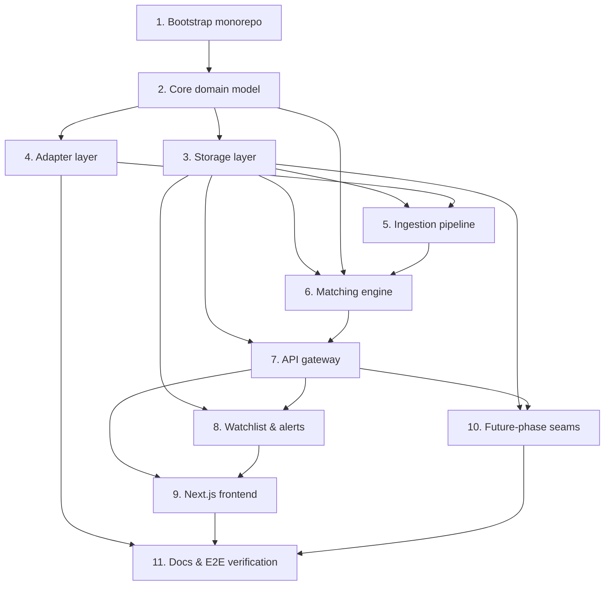

# Implementation Plan

## Overview

This plan implements the Prediction Market Aggregator incrementally: core domain model first, then storage, adapters, ingestion, matching, API, alerts, and frontend. Property-based tests (fast-check) are included for the design's correctness properties. Each task references the requirements it implements. v1 is strictly read-only.

## Tasks

- [x] 1. Bootstrap monorepo and shared tooling
  - Initialize the package workspace layout (`packages/core`, `adapters`, `ingestion`, `matching`, `storage`, `api`, `alerts`, `apps/web`) per the design module layout.
  - Configure TypeScript, linting, formatting, and a test runner; add `fast-check` for property-based tests.
  - Add `docker-compose.yml` with Postgres+TimescaleDB and Redis for local development.
  - Add a `docs/` folder with an architecture overview and an adapter-authoring guide stub (open-source friendly).
  - _Requirements: 8.1, 10.1_

- [x] 2. Implement the normalized core domain model
  - [x] 2.1 Define domain types and value objects
    - Implement `Source`, `Event`, `Market`, `Outcome`, `PricePoint`, `CanonicalEvent`, `ResolutionCriteria`, `Category` in `packages/core/src/model` with no I/O dependencies.
    - Implement normalization/validation helpers (probability bounds, binary-sum tolerance, non-negative spread).
    - _Requirements: 1.3, 10.1, 10.3_
  - [x] 2.2 Define port interfaces
    - Implement the `MarketSource` interface, `SourceCapabilities`, `PageRequest`/`Page`, and repository interfaces in `packages/core/src/ports`.
    - _Requirements: 8.2, 10.1_
  - [x] 2.3 Write property test for normalization invariants (PBT)
    - Using fast-check, generate random raw outcomes and assert normalized `impliedProb`/`lastPrice` are within [0,1] and binary outcomes sum to within tolerance of 1.
    - _Requirements: 1.3_

- [x] 3. Implement storage layer (Postgres + TimescaleDB + Redis)
  - [x] 3.1 Create schema migrations
    - Implement the SQL migrations for `source`, `event`, `market` (with `category` denormalized + `resolution_mismatch`), `outcome`, `canonical_event`, `sync_cursor`, `watchlist_item`, `alert_rule`, `match_label`, and the `price_point` hypertable. Add the FTS GIN index and `(category, status)` index.
    - _Requirements: 10.1, 10.2_
  - [x] 3.2 Implement repositories with idempotent upserts
    - Implement `MarketRepository`, `OutcomeRepository`, `PricePointRepository`, `CanonicalEventRepository`, and `CursorRepository` with `ON CONFLICT` upserts keyed on `(source_id, external_id)` and `(market_id, outcome_id, ts)`.
    - _Requirements: 7.1, 7.2, 10.1, 10.2_
  - [x] 3.3 Implement Redis hot-price cache and pub/sub
    - Implement hot-price set/get with TTL and pub/sub channels for market/canonical updates.
    - _Requirements: 10.4, 9.2_
  - [x] 3.4 Write property test for idempotent ingestion (PBT)
    - Using fast-check, generate market sets and assert `upsert(m) ∘ upsert(m) ≡ upsert(m)` (row count and content unchanged after repeats).
    - _Requirements: 7.1_
  - [x] 3.5 Write property test for idempotent price writes (PBT)
    - Using fast-check, generate price-point streams with duplicates and reorderings; assert exactly one row per `(market_id, outcome_id, ts)`.
    - _Requirements: 7.2_

- [x] 4. Implement the adapter layer
  - [x] 4.1 Implement the adapter registry
    - Implement `AdapterRegistry` (`register`, `all`, `byKey`) and source registration that resolves `meta.id`.
    - _Requirements: 8.4_
  - [x] 4.2 Implement the Polymarket adapter
    - Implement `MarketSource` against Gamma API (events/markets metadata, keyset pagination), CLOB API (price snapshot, history, depth), and the WebSocket market channel for `subscribePrices`. Declare full capabilities.
    - Map a binary Yes/No market to outcomes with the Yes-token price as implied probability; capture raw resolution criteria.
    - _Requirements: 8.2, 8.3, 1.1, 4.2, 4.3, 10.3_
  - [x] 4.3 Implement the Manifold adapter
    - Implement `MarketSource` against the Manifold REST API; declare `websocketPrices = false` so the orchestrator uses tiered polling. Implement `fetchPriceHistory` for backfill/curves.
    - _Requirements: 8.2, 8.3, 1.1, 4.2_
  - [x] 4.4 Write adapter normalization tests from recorded fixtures
    - Add unit tests that feed recorded Gamma/CLOB/Manifold payloads and assert correct normalized entities and cursor round-tripping.
    - _Requirements: 1.1, 1.5_
  - [x] 4.5 Write property test for adapter isolation / capability gating (PBT)
    - Using fast-check over generated capability sets, assert the orchestrator invokes `subscribePrices` only when `websocketPrices === true`, and never otherwise.
    - _Requirements: 7.4, 8.1, 8.3_
  - [x] 4.6 Implement the Predict.fun adapter
    - Implement `MarketSource` against the Predict.fun REST API (BNB-Chain CLOB; `GET /v1/markets` cursor pagination, `/orderbook`, `/timeseries`). Declare `websocketPrices = false` so the orchestrator uses tiered polling; derive the Yes implied probability from the order-book best-bid/ask mid. Support the mainnet `x-api-key` header. Add unit + recorded-fixture normalization tests.
    - _Requirements: 8.2, 8.3, 1.1, 4.2, 4.3, 10.3_

- [x] 5. Implement the ingestion pipeline
  - [x] 5.1 Implement metadata incremental sync
    - Implement `syncMarkets` with keyset pagination, normalize+validate, idempotent upsert, and enqueue-for-matching. Persist the cursor only after a page is durably written; never advance on failure.
    - _Requirements: 7.1, 7.3, 11.1_
  - [x] 5.2 Implement resilient fetch wrapper
    - Implement `withRetry` with per-source token-bucket rate limiting and jittered exponential backoff; retry transient errors only, propagate non-retryable ones.
    - _Requirements: 7.5_
  - [x] 5.3 Implement price tiering and stream management
    - Implement `classifyTier` (active vs long-tail), `managePriceStream` (WebSocket where capable, polling fallback), `onTick` (hot cache + idempotent price write + fan-out publish).
    - _Requirements: 7.4, 10.4, 9.2_
  - [x] 5.4 Implement WebSocket reconnect with backfill
    - Implement reconnect-with-backoff and gap backfill via `fetchPriceHistory` so curves have no holes.
    - _Requirements: 7.6, 4.4_
  - [x] 5.5 Write property test for cursor monotonicity (PBT)
    - Using fast-check over interleaved success/failure sync sequences, assert cursors never regress and are saved only after durable writes.
    - _Requirements: 7.3_
  - [x] 5.6 Write integration test for resilience against a mock adapter server
    - Replay recorded upstream responses with injected 429s, 5xx, and WS drops; verify backoff, reconnect-backfill, and crash-safe cursor resume.
    - _Requirements: 7.5, 7.6, 4.4_
  - [x] 5.7 Implement the resident ingestion runner entrypoint
    - Wire the registry + `syncMarkets` (through the resilient fetch wrapper) + resilient price streams into a runnable service (`packages/ingestion/src/main.ts`): resolve source ids, periodically sync metadata for each registered adapter, select active markets via `classifyTier`, and start WebSocket/polling price streams feeding `onTick`. Per-source price-id strategy (Polymarket by CLOB token id, others by market id) and a fail-fast request timeout. Unit-tested with injected fakes (`runner.test.ts`).
    - _Requirements: 7.1, 7.3, 7.4, 7.5, 7.6, 8.4, 9.2, 10.4_

- [x] 6. Implement the same-question matching engine
  - [x] 6.1 Implement Layer 1 rules/metadata pre-filter
    - Implement candidate search by category, time window, subject-entity extraction, and threshold extraction.
    - _Requirements: 11.1_
  - [x] 6.2 Implement Layer 2 semantic similarity
    - Implement a provider-agnostic embedding interface and cosine-similarity scoring with a configurable threshold.
    - _Requirements: 11.1_
  - [x] 6.3 Implement Layer 3 calibration queue and labeled data
    - Route below-threshold/high-value pairs to a human calibration queue; persist decisions to `match_label`.
    - _Requirements: 11.2, 11.4_
  - [x] 6.4 Implement Layer 4 resolution-criteria alignment and linking
    - Implement `criteriaAligned` and `linkToCanonical`; set `resolutionMismatch = true` on material divergence (data source, cutoff, rounding).
    - _Requirements: 11.3, 2.3_
  - [x] 6.5 Implement spread/signal computation
    - Implement `computeSignals` over open, non-mismatched markets; return per-platform probabilities, max gap, and `executable: false`.
    - _Requirements: 3.1, 3.2, 3.3, 3.4_
  - [x] 6.6 Write property test for no-false-arbitrage (PBT)
    - Using fast-check, generate canonical events mixing aligned and mismatched markets; assert every market in a returned signal has `resolutionMismatch = false` and signals are absent below two aligned markets.
    - _Requirements: 3.2, 3.4_
  - [x] 6.7 Write property test for display-only invariant (PBT)
    - Using fast-check over generated signal inputs, assert every returned signal has `executable === false`.
    - _Requirements: 3.3, 12.1_
  - [x] 6.8 Write property test for comparison symmetry (PBT)
    - Using fast-check, assert canonical-event linkage is symmetric and `maxSpread` is order-independent.
    - _Requirements: 2.2_

- [x] 7. Implement the outbound API gateway
  - [x] 7.1 Implement discovery and detail endpoints
    - Implement `GET /api/markets` (category/search/status filter, sort), `GET /api/markets/{id}`, `GET /api/markets/{id}/history`, `GET /api/sources`. Serve latest prices from Redis.
    - _Requirements: 1.1, 1.2, 1.4, 1.5, 4.1, 4.2, 4.3, 9.1, 10.4_
  - [x] 7.2 Implement comparison and signals endpoints
    - Implement `GET /api/canonical-events`, `GET /api/canonical-events/{id}` (ComparisonView with mismatch flags), and `GET /api/signals` (display-only).
    - _Requirements: 2.1, 2.3, 2.4, 3.1, 3.2, 3.3, 9.1_
  - [x] 7.3 Implement trade-link endpoint
    - Implement `GET /api/markets/{id}/trade-link` returning a source deep-link; ensure no execution path exists and the slot is replaceable.
    - _Requirements: 6.1, 6.2, 6.3, 12.1_
  - [x] 7.4 Implement WebSocket fan-out
    - Implement `WS /ws` channels (market, canonical, alerts) fed by Redis pub/sub.
    - _Requirements: 9.2_
  - [x] 7.5 Implement gateway hardening
    - Add unified rate limiting and input validation on public read endpoints; require authentication for user-scoped resources.
    - _Requirements: 9.3, 9.4_
  - [x] 7.6 Write API contract tests
    - Add contract tests for each REST endpoint and the WebSocket fan-out against seeded data, asserting response shapes and the display-only/no-execution guarantees.
    - _Requirements: 9.1, 3.3, 6.2_

- [x] 8. Implement watchlist and alerts
  - [x] 8.1 Implement watchlist endpoints and persistence
    - Implement add/list/delete with duplicate prevention per `(user, target_type, target_id)`.
    - _Requirements: 5.1, 5.4, 9.4_
  - [x] 8.2 Implement alert-rule endpoints and persistence
    - Implement create/list/delete for `thresholdCross` and `spreadWiden` rules with parameters and active flag.
    - _Requirements: 5.2, 5.4, 9.4_
  - [x] 8.3 Implement alert evaluation and dispatch
    - Evaluate rules against incoming price/spread updates and dispatch notifications via the alerts WebSocket channel.
    - _Requirements: 5.3, 9.2_

- [x] 9. Implement the Next.js frontend
  - [x] 9.1 Implement discovery and detail pages
    - Build the discovery list (filters, search, sort) and market detail with a price-history curve (Recharts / lightweight-charts), talking only to the project API.
    - _Requirements: 1.1, 1.2, 1.4, 4.1, 4.2, 9.1_
  - [x] 9.2 Implement comparison and signals views
    - Build the side-by-side comparison view (with mismatch flags) and the spread-signals list (display-only), with a "Go trade" deep-link button.
    - _Requirements: 2.1, 2.3, 3.1, 3.3, 6.1_
  - [x] 9.3 Implement watchlist and live updates
    - Build watchlist management and subscribe to the WebSocket fan-out for live price/spread/alert updates.
    - _Requirements: 5.1, 5.3, 9.2_

- [x] 10. Reserve future-phase seams (designed-for, not executing)
  - Add a per-source `redistribution_policy` field and a user-region dimension placeholder in the schema/config to reserve compliance seams; document that no trade-routing/geofencing logic is implemented in v1.
  - Document the trade-link replacement seam for future "one-click participate".
  - _Requirements: 12.1, 12.2, 12.3, 6.3_

- [x] 11. Finalize open-source documentation and end-to-end verification
  - Complete the adapter-authoring guide, architecture docs, and data-model docs in `docs/`.
  - Run the full unit, property-based, and integration suites; verify the build and that all correctness-property tests pass.
  - _Requirements: 8.1, 8.2_

## Task Dependency Graph



```json
{
  "waves": [
    { "wave": 1, "tasks": ["1"] },
    { "wave": 2, "tasks": ["2"] },
    { "wave": 3, "tasks": ["3", "4"] },
    { "wave": 4, "tasks": ["5"] },
    { "wave": 5, "tasks": ["6"] },
    { "wave": 6, "tasks": ["7"] },
    { "wave": 7, "tasks": ["8", "10"] },
    { "wave": 8, "tasks": ["9"] },
    { "wave": 9, "tasks": ["11"] }
  ]
}
```

## Notes

- **Sequencing**: Tasks 3 and 4 can proceed in parallel after task 2. Task 5 (ingestion) requires both storage (3) and adapters (4). Task 6 (matching) requires the model, storage, and ingested data. Tasks 7–9 build the read/serve and UI layers on top.
- **Property-based tests**: Tasks 2.3, 3.4, 3.5, 4.5, 5.5, 6.6, 6.7, and 6.8 are PBT tasks using `fast-check`, each mapped to a design correctness property (P1–P9). Run them and record status; on failure, capture the fast-check counterexample.
- **Read-only invariant**: No task introduces order placement, fund routing, or execution. Task 10 only reserves schema/config seams and documents them; it does not implement trade routing or geofencing.
- **Verification**: After each implementation task, run the relevant unit/property/integration tests. Task 11 runs the full suite and verifies the build.
- **Open-source**: Keep adapter modules self-contained and the adapter-authoring guide current so external contributors can add platforms without touching core, matching, or API code.
