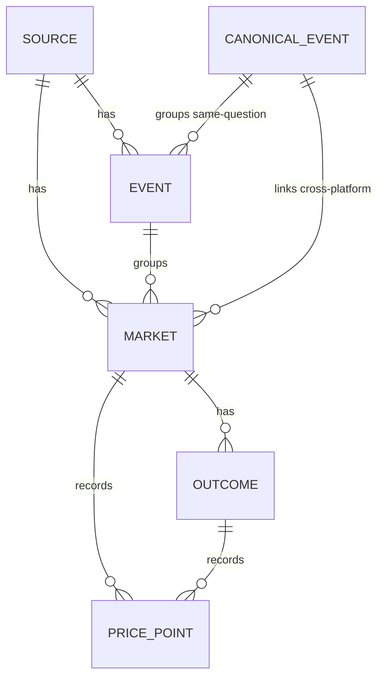

# Data Model

> Status: living document. The authoritative design lives in
> [`.kiro/specs/prediction-market-aggregator/design.md`](../.kiro/specs/prediction-market-aggregator/design.md)
> ("Data Models" and "Storage Schemas"). This document describes the normalized
> domain model, validation rules, and the concrete storage schema as
> implemented.

The normalized schema is the project's core asset. It is **platform-agnostic**:
every adapter maps its raw payload into these entities, so the matching engine,
API gateway, and frontend never deal with platform-specific shapes. The pair
`(source_id, external_id)` is the universal idempotency key for ingested
entities.

## Domain model

The TypeScript domain types live in
[`packages/core/src/model`](../packages/core/src/model) (an I/O-free package).
They mirror the relational schema one-to-one.

| Entity               | File                                                                          | Identity                      | Purpose                                                                    |
| -------------------- | ----------------------------------------------------------------------------- | ----------------------------- | -------------------------------------------------------------------------- |
| `Source`             | [`source.ts`](../packages/core/src/model/source.ts)                           | `id` (UUID)                   | A registered platform (`onchain` \| `cex` \| `regulated`) + base currency. |
| `Event`              | [`event.ts`](../packages/core/src/model/event.ts)                             | `(source_id, external_id)`    | A platform-native grouping of related markets.                             |
| `Market`             | [`market.ts`](../packages/core/src/model/market.ts)                           | `(source_id, external_id)`    | The smallest unit of aggregation — a single question.                      |
| `Outcome`            | [`outcome.ts`](../packages/core/src/model/outcome.ts)                         | `(market_id, label)`          | A leg of a market (Yes/No/candidate) with `impliedProb` + `lastPrice`.     |
| `PricePoint`         | [`price-point.ts`](../packages/core/src/model/price-point.ts)                 | `(market_id, outcome_id, ts)` | A time-series price observation (TimescaleDB hypertable row).              |
| `CanonicalEvent`     | [`canonical-event.ts`](../packages/core/src/model/canonical-event.ts)         | `id` (UUID)                   | A cross-platform grouping linking the same real-world question.            |
| `ResolutionCriteria` | [`resolution-criteria.ts`](../packages/core/src/model/resolution-criteria.ts) | embedded in `Market`          | How a market settles; `raw` is always preserved for auditability.          |
| `Category`           | [`category.ts`](../packages/core/src/model/category.ts)                       | enum                          | `politics` \| `crypto` \| `sports` \| `economics` \| `tech` \| `other`.    |

### Entity relationships

- A `Market` belongs to exactly one `Source`, optionally to one platform `Event`,
  and optionally to one `CanonicalEvent` (null until the matching engine links
  it cross-platform).
- `CanonicalEvent` is the basis for the comparison view and spread signals: only
  once two or more markets are linked to it (with aligned resolution criteria)
  can a cross-platform gap be computed.
- `category` is **denormalized onto `market`** (in addition to `event` /
  `canonical_event`) so discovery filtering is a single indexed lookup.

### Adapter-facing "normalized" shapes

Adapters return _raw-normalized_ payloads (already mapped to the domain shape
but not yet persisted, so they carry no internal UUIDs). These live alongside
the port in [`packages/core/src/ports/market-source.ts`](../packages/core/src/ports/market-source.ts):
`NormalizedEvent`, `NormalizedMarket`, `NormalizedOutcome`,
`NormalizedPriceSnapshot` (and its alias `NormalizedPricePoint`). The
persistence layer resolves `(source_id, external_id)` → internal UUID on upsert.

## Validation rules

The normalization/validation helpers are pure functions in
[`packages/core/src/model/validation.ts`](../packages/core/src/model/validation.ts).
The relational schema enforces the same rules with `CHECK` constraints as a
second line of defense.

| Rule                                | Domain helper                                                        | Schema constraint                                                                                                  | Requirement |
| ----------------------------------- | -------------------------------------------------------------------- | ------------------------------------------------------------------------------------------------------------------ | ----------- |
| Probability bounds `0 ≤ p ≤ 1`      | `normalizeProbability` / `clampProbability`                          | `outcome.implied_prob`/`last_price` `CHECK (… BETWEEN 0 AND 1)`; `price_point.price CHECK (price BETWEEN 0 AND 1)` | 1.3         |
| Binary sum-to-one within tolerance  | `normalizeBinaryProbabilities` (ε = `BINARY_SUM_TOLERANCE` = `0.01`) | — (normalized + logged at the ingestion boundary)                                                                  | 1.3         |
| Spread is non-negative              | `normalizeSpread`                                                    | `market.spread CHECK (spread >= 0)`                                                                                | 1.3         |
| Missing values explicit (not fatal) | nullable fields; `null` rather than throw                            | nullable columns                                                                                                   | 1.5         |
| Raw resolution criteria preserved   | `normalizeResolutionCriteria` (always sets `raw`)                    | `market.resolution_criteria JSONB NOT NULL DEFAULT '{}'`                                                           | 10.3        |

Notes:

- **Binary sum tolerance.** A binary market's outcome probabilities should sum to
  ≈ 1. If the clamped values are already within `0.01` of 1 they pass through
  unchanged; otherwise they are rescaled to sum to exactly 1 and the deviation is
  reported so the ingestion layer can log the correction. A degenerate all-zero
  set is left as-is. Pure domain code never logs; it returns the deviation.
- **Raw criteria.** `ResolutionCriteria.raw` is **always** retained even when the
  structured fields (`dataSource`, `cutoffTime`, `rounding`) cannot be parsed.
  Matching Layer 4 relies on this to detect resolution mismatches that would
  otherwise produce false arbitrage signals.

## Storage schema

Postgres holds relational metadata; `price_point` is a TimescaleDB hypertable;
Redis holds the hot latest-price cache and the pub/sub channels. The SQL lives
in [`packages/storage/migrations`](../packages/storage/migrations) and is applied
in lexicographic order (see the
[migrations README](../packages/storage/migrations/README.md)).

### `001_core.sql` — core relational + time-series schema

Extensions: `pgcrypto` (for `gen_random_uuid()`) and `timescaledb`.

| Table             | Idempotency / primary key                                                      | Notable columns & constraints                                                                                                                                                                                                                       |
| ----------------- | ------------------------------------------------------------------------------ | --------------------------------------------------------------------------------------------------------------------------------------------------------------------------------------------------------------------------------------------------- |
| `source`          | `id` PK, `key` UNIQUE                                                          | `type CHECK (onchain\|cex\|regulated)`, `base_currency`.                                                                                                                                                                                            |
| `canonical_event` | `id` PK                                                                        | `category CHECK`, `subject_entity`, `threshold_value`, `target_date` (matching Layer 1 inputs).                                                                                                                                                     |
| `event`           | `id` PK, **`UNIQUE (source_id, external_id)`**                                 | `canonical_event_id` FK (nullable), `category CHECK`, `end_date`.                                                                                                                                                                                   |
| `market`          | `id` PK, **`UNIQUE (source_id, external_id)`**                                 | denormalized `category CHECK`, `status CHECK (open\|closed\|resolved)`, `volume_24h`, `liquidity`, `spread CHECK (>= 0)`, `resolution_criteria JSONB NOT NULL DEFAULT '{}'`, `resolution_mismatch BOOLEAN` (set by matching Layer 4), `updated_at`. |
| `outcome`         | `id` PK, `UNIQUE (market_id, label)`                                           | `token_id` (on-chain token; null off-chain), `implied_prob`/`last_price CHECK (BETWEEN 0 AND 1)`.                                                                                                                                                   |
| `price_point`     | **`PRIMARY KEY (market_id, outcome_id, ts)`** — TimescaleDB hypertable on `ts` | `price NOT NULL CHECK (BETWEEN 0 AND 1)`, `volume`.                                                                                                                                                                                                 |
| `sync_cursor`     | `PRIMARY KEY (source_id, entity)`                                              | `entity CHECK (event\|market)`, opaque `cursor`, `updated_at` (crash-safe keyset resume).                                                                                                                                                           |
| `watchlist_item`  | `id` PK, `UNIQUE (user_id, target_type, target_id)`                            | `target_type CHECK (market\|canonicalEvent)` — duplicate prevention.                                                                                                                                                                                |
| `alert_rule`      | `id` PK                                                                        | `rule_type CHECK (thresholdCross\|spreadWiden)`, `params JSONB`, `active`.                                                                                                                                                                          |
| `match_label`     | `id` PK, `UNIQUE (market_a_id, market_b_id)`                                   | `decision CHECK (same\|different)`, `similarity CHECK (0..1)`, `labeled_by CHECK (human\|auto)` — calibration training data.                                                                                                                        |

Indexes:

- `idx_market_canonical` on `market(canonical_event_id)` — comparison lookups.
- `idx_market_category_status` on `market(category, status)` — discovery filter.
- `idx_market_question_fts` — GIN index on `to_tsvector('english', question)`
  for full-text discovery search.

#### Idempotency keys (the two that matter most)

- **Metadata** (`event`, `market`): `UNIQUE (source_id, external_id)`. Repeated
  syncs of the same upstream state upsert in place — no duplicate rows, no net
  change (Requirement 7.1 / Property 1).
- **Prices** (`price_point`): `PRIMARY KEY (market_id, outcome_id, ts)`.
  Overlapping live ticks and reconnect-backfill points collapse to exactly one
  row per key (Requirement 7.2 / Property 2).

#### TimescaleDB hypertable

`price_point` is converted to a hypertable on the `ts` time dimension
(`SELECT create_hypertable('price_point', 'ts')`), giving time-partitioned
storage and cheap range scans for price-history curves. The
`(market_id, outcome_id, ts)` primary key keeps writes idempotent.

### `002_compliance_seams.sql` — reserved future-phase seams (NOT implemented in v1)

This migration only **reserves** schema seams; v1 reads/gates on none of them
(see [`compliance-and-future-seams.md`](./compliance-and-future-seams.md)).

- `source.redistribution_policy JSONB NOT NULL DEFAULT '{}'` — records a
  per-source data-redistribution policy for future commercial/B2B exposure
  gating (Req 12.2). Recorded only; never enforced in v1.
- `user_profile` table with a nullable `region` column — reserves a user-region
  dimension for future regulated geo-partitioning (Req 12.3). Reserved and
  uninterpreted; v1 implements no routing/geofencing.

## Redis: hot cache + pub/sub

Redis is not migrated (no SQL); its key scheme is defined in code.

### Hot latest-price cache

Implemented in
[`packages/storage/src/redis/hot-price-cache.ts`](../packages/storage/src/redis/hot-price-cache.ts).
The ingestion `onTick` path writes the latest price for each market outcome so
the API gateway serves discovery/detail "latest price" reads without touching
the hypertable (Requirement 10.4).

- **Key scheme:** one Redis **hash** per market, `hotprice:{marketId}`, whose
  fields are outcome labels and whose values are JSON `{ price, volume, ts }`.
- A single `HGETALL` reads all of a market's outcome prices in one round-trip.
- Each write refreshes a short TTL (default 30s), so actively-updating markets
  stay warm while stale ones expire out of the cache.

### Pub/sub channels (WebSocket fan-out)

Channel naming + the message envelope are defined in
[`packages/storage/src/redis/channels.ts`](../packages/storage/src/redis/channels.ts)
(Requirement 9.2). Ingestion publishes; the API gateway's `WS /ws` relays to
subscribed clients.

| Channel               | Carries                                      | Message `type` |
| --------------------- | -------------------------------------------- | -------------- |
| `chan:market:{id}`    | live price ticks for a single market         | `price`        |
| `chan:canonical:{id}` | live spread updates for a canonical grouping | `spread`       |
| `chan:alerts`         | user alert notifications                     | `alert`        |

The fan-out envelope keeps the design's three-field shape:
`{ channel, type, payload }`, where `channel` is the full Redis channel name
(decodable back to a kind + id via `parseChannel`).

## See also

- [Architecture overview](./architecture.md) — how these entities flow through
  ingestion, matching, the API gateway, and the frontend.
- [Adapter authoring guide](./adapter-authoring-guide.md) — how an adapter maps
  raw upstream payloads into these normalized entities.
- [Correctness properties](./correctness-properties.md) — the property-based
  guarantees over this model (idempotency, probability bounds, no false
  arbitrage, …).
- [Compliance & future seams](./compliance-and-future-seams.md) — the reserved
  `002_compliance_seams.sql` columns/tables.
