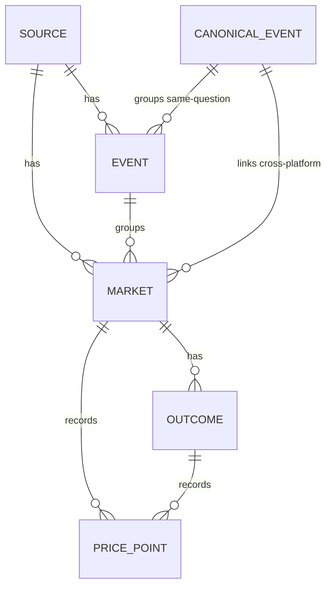

# 数据模型

> 状态：持续维护的活文档。权威设计见
> [`.kiro/specs/prediction-market-aggregator/design.md`](../../.kiro/specs/prediction-market-aggregator/design.md)
> 的「Data Models」与「Storage Schemas」。英文版本：[`docs/data-model.md`](../data-model.md)。
> 本文档描述规范化领域模型、校验规则，以及实际落地的存储结构。

规范化数据结构是本项目的核心资产。它**与平台无关**：每个适配器把自己的原始载荷映射成这些实体，
因此匹配引擎、API 网关与前端都不必直接处理平台特有的形状。`(source_id, external_id)` 是所有被
摄取实体的通用幂等键。

## 领域模型

TypeScript 领域类型位于
[`packages/core/src/model`](../../packages/core/src/model)（一个无 I/O 的包），与关系型 schema
一一对应。

| 实体                 | 文件                                                                             | 标识                          | 用途                                                              |
| -------------------- | -------------------------------------------------------------------------------- | ----------------------------- | ----------------------------------------------------------------- |
| `Source`             | [`source.ts`](../../packages/core/src/model/source.ts)                           | `id` (UUID)                   | 已注册平台（`onchain` \| `cex` \| `regulated`）+ 基准货币。        |
| `Event`              | [`event.ts`](../../packages/core/src/model/event.ts)                             | `(source_id, external_id)`    | 平台原生的相关市场分组。                                          |
| `Market`             | [`market.ts`](../../packages/core/src/model/market.ts)                           | `(source_id, external_id)`    | 聚合的最小单元——单个问题。                                        |
| `Outcome`            | [`outcome.ts`](../../packages/core/src/model/outcome.ts)                         | `(market_id, label)`          | 市场的一条腿（Yes/No/候选人），带 `impliedProb` 与 `lastPrice`。  |
| `PricePoint`         | [`price-point.ts`](../../packages/core/src/model/price-point.ts)                 | `(market_id, outcome_id, ts)` | 一条时间序列价格观测（TimescaleDB 超表的一行）。                  |
| `CanonicalEvent`     | [`canonical-event.ts`](../../packages/core/src/model/canonical-event.ts)         | `id` (UUID)                   | 跨平台分组，链接同一个真实世界问题。                              |
| `ResolutionCriteria` | [`resolution-criteria.ts`](../../packages/core/src/model/resolution-criteria.ts) | 内嵌在 `Market`               | 市场如何结算；`raw` 始终保留以备审计。                            |
| `Category`           | [`category.ts`](../../packages/core/src/model/category.ts)                       | 枚举                          | `politics` \| `crypto` \| `sports` \| `economics` \| `tech` \| `other`。 |

### 实体关系

- 一个 `Market` 恰好属于一个 `Source`，可选属于一个平台 `Event`，并可选属于一个
  `CanonicalEvent`（在匹配引擎跨平台链接之前为 null）。
- `CanonicalEvent` 是对比视图与价差信号的基础：只有当两个或更多市场被链接到它（且结算口径一致）
  之后，才能计算跨平台价差。
- `category`（类别）被**反规范化到 `market`**（同时也在 `event` / `canonical_event` 上），使发现
  筛选成为单次有索引的查询。

### 面向适配器的「规范化」形状

适配器返回的是「原始-规范化」载荷（已经映射成领域形状，但尚未持久化，因此不带内部 UUID）。它们
与端口一起定义在
[`packages/core/src/ports/market-source.ts`](../../packages/core/src/ports/market-source.ts)：
`NormalizedEvent`、`NormalizedMarket`、`NormalizedOutcome`、`NormalizedPriceSnapshot`（及其别名
`NormalizedPricePoint`）。持久化层在 upsert 时把 `(source_id, external_id)` 解析为内部 UUID。

## 校验规则

规范化/校验辅助函数是
[`packages/core/src/model/validation.ts`](../../packages/core/src/model/validation.ts)
中的纯函数。关系型 schema 用 `CHECK` 约束作为第二道防线强制同样的规则。

| 规则                                | 领域辅助函数                                                          | Schema 约束                                                                                                         | 需求    |
| ----------------------------------- | -------------------------------------------------------------------- | ------------------------------------------------------------------------------------------------------------------ | ------- |
| 概率边界 `0 ≤ p ≤ 1`                | `normalizeProbability` / `clampProbability`                          | `outcome.implied_prob`/`last_price` `CHECK (… BETWEEN 0 AND 1)`；`price_point.price CHECK (price BETWEEN 0 AND 1)` | 1.3     |
| 二元概率在容差内求和为 1            | `normalizeBinaryProbabilities`（ε = `BINARY_SUM_TOLERANCE` = `0.01`）| ——（在摄取边界处规范化并记录日志）                                                                                 | 1.3     |
| 价差非负                            | `normalizeSpread`                                                    | `market.spread CHECK (spread >= 0)`                                                                                | 1.3     |
| 缺失值显式表示（不致命）            | 可空字段；返回 `null` 而非抛错                                       | 可空列                                                                                                             | 1.5     |
| 保留原始结算口径                    | `normalizeResolutionCriteria`（始终设置 `raw`）                      | `market.resolution_criteria JSONB NOT NULL DEFAULT '{}'`                                                           | 10.3    |

说明：

- **二元求和容差。** 二元市场的结果概率应当求和约等于 1。若裁剪后的值已在 `0.01` 容差内，则原样
  通过；否则会重新缩放到精确求和为 1，并报告偏差，以便摄取层记录该次修正。退化的全零集合保持原样。
  纯领域代码不打日志，只返回偏差。
- **原始口径。** 即使结构化字段（`dataSource`、`cutoffTime`、`rounding`）无法解析，
  `ResolutionCriteria.raw` 也**始终**保留。匹配第 4 层依赖它来检测结算口径不一致，从而避免产生伪套利
  信号。

## 存储结构

Postgres 保存关系型元数据；`price_point` 是一个 TimescaleDB 超表；Redis 保存最新价热缓存与发布/订阅
频道。SQL 位于
[`packages/storage/migrations`](../../packages/storage/migrations)，按文件名字典序应用（见
[迁移说明](../../packages/storage/migrations/README.md)）。

### `001_core.sql` —— 核心关系型 + 时间序列结构

扩展：`pgcrypto`（提供 `gen_random_uuid()`）与 `timescaledb`。

| 表                | 幂等键 / 主键                                                                  | 关键列与约束                                                                                                                                                                                                                                                |
| ----------------- | ------------------------------------------------------------------------------ | ----------------------------------------------------------------------------------------------------------------------------------------------------------------------------------------------------------------------------------------------------------- |
| `source`          | `id` 主键，`key` UNIQUE                                                        | `type CHECK (onchain\|cex\|regulated)`、`base_currency`。                                                                                                                                                                                                   |
| `canonical_event` | `id` 主键                                                                      | `category CHECK`、`subject_entity`、`threshold_value`、`target_date`（匹配第 1 层的输入）。                                                                                                                                                                 |
| `event`           | `id` 主键，**`UNIQUE (source_id, external_id)`**                              | `canonical_event_id` 外键（可空）、`category CHECK`、`end_date`。                                                                                                                                                                                           |
| `market`          | `id` 主键，**`UNIQUE (source_id, external_id)`**                              | 反规范化的 `category CHECK`、`status CHECK (open\|closed\|resolved)`、`volume_24h`、`liquidity`、`spread CHECK (>= 0)`、`resolution_criteria JSONB NOT NULL DEFAULT '{}'`、`resolution_mismatch BOOLEAN`（由匹配第 4 层设置）、`updated_at`。                  |
| `outcome`         | `id` 主键，`UNIQUE (market_id, label)`                                         | `token_id`（链上代币；链下为空）、`implied_prob`/`last_price CHECK (BETWEEN 0 AND 1)`。                                                                                                                                                                     |
| `price_point`     | **`PRIMARY KEY (market_id, outcome_id, ts)`** —— 以 `ts` 为时间维的 TimescaleDB 超表 | `price NOT NULL CHECK (BETWEEN 0 AND 1)`、`volume`。                                                                                                                                                                                                        |
| `sync_cursor`     | `PRIMARY KEY (source_id, entity)`                                             | `entity CHECK (event\|market)`、不透明 `cursor`、`updated_at`（崩溃安全的 keyset 续传）。                                                                                                                                                                   |
| `watchlist_item`  | `id` 主键，`UNIQUE (user_id, target_type, target_id)`                         | `target_type CHECK (market\|canonicalEvent)` —— 去重。                                                                                                                                                                                                      |
| `alert_rule`      | `id` 主键                                                                      | `rule_type CHECK (thresholdCross\|spreadWiden)`、`params JSONB`、`active`。                                                                                                                                                                                 |
| `match_label`     | `id` 主键，`UNIQUE (market_a_id, market_b_id)`                                | `decision CHECK (same\|different)`、`similarity CHECK (0..1)`、`labeled_by CHECK (human\|auto)` —— 校准训练数据。                                                                                                                                            |

索引：

- `idx_market_canonical`，在 `market(canonical_event_id)` 上 —— 对比查找。
- `idx_market_category_status`，在 `market(category, status)` 上 —— 发现筛选。
- `idx_market_question_fts` —— `to_tsvector('english', question)` 上的 GIN 索引，用于全文发现搜索。

#### 幂等键（最重要的两个）

- **元数据**（`event`、`market`）：`UNIQUE (source_id, external_id)`。对同一上游状态的重复同步会
  原地 upsert —— 不产生重复行，也不产生净变化（需求 7.1 / 属性 P1）。
- **价格**（`price_point`）：`PRIMARY KEY (market_id, outcome_id, ts)`。重叠的实时 tick 与重连回填点
  会折叠为每个键恰好一行（需求 7.2 / 属性 P2）。

#### TimescaleDB 超表

`price_point` 在 `ts` 时间维上转换为超表（`SELECT create_hypertable('price_point', 'ts')`），从而获得
按时间分区的存储与廉价的范围扫描以绘制价格历史曲线。`(market_id, outcome_id, ts)` 主键保证写入幂等。

### `002_compliance_seams.sql` —— 预留的未来阶段接缝（v1 未实现）

此迁移只**预留** schema 接缝；v1 不读取也不据此做任何门控（见
[`compliance-and-future-seams.md`](./compliance-and-future-seams.md)）。

- `source.redistribution_policy JSONB NOT NULL DEFAULT '{}'` —— 记录每个来源的数据再分发策略，供未来
  商业/B2B 暴露门控（需求 12.2）。仅记录，v1 从不强制执行。
- `user_profile` 表，带可空 `region` 列 —— 为未来受监管的地理分区预留用户区域维度（需求 12.3）。
  仅预留且不被解读；v1 不实现任何路由/地理围栏。

## Redis：热缓存 + 发布/订阅

Redis 不做迁移（无 SQL）；其键方案在代码中定义。

### 最新价热缓存

实现于
[`packages/storage/src/redis/hot-price-cache.ts`](../../packages/storage/src/redis/hot-price-cache.ts)。
摄取的 `onTick` 路径为每个市场结果项写入最新价，使 API 网关能在不触碰超表的情况下提供发现/详情的
「最新价」读取（需求 10.4）。

- **键方案：** 每个市场一个 Redis **哈希**，键为 `hotprice:{marketId}`，字段为结果项 label，值为 JSON
  `{ price, volume, ts }`。
- 一次 `HGETALL` 即可在一个来回中读出某市场所有结果项的价格。
- 每次写入都会刷新一个较短的 TTL（默认 30s），因此活跃更新的市场保持「温」，而陈旧的市场会从缓存中过期。

### 发布/订阅频道（WebSocket 扇出）

频道命名与消息封套定义在
[`packages/storage/src/redis/channels.ts`](../../packages/storage/src/redis/channels.ts)（需求 9.2）。
摄取负责发布；API 网关的 `WS /ws` 转发给订阅的客户端。

| 频道                  | 承载内容                                 | 消息 `type` |
| --------------------- | ---------------------------------------- | ----------- |
| `chan:market:{id}`    | 单个市场的实时价格 tick                  | `price`     |
| `chan:canonical:{id}` | 某规范分组的实时价差更新                 | `spread`    |
| `chan:alerts`         | 用户告警通知                             | `alert`     |

扇出封套保持设计中的三字段形状：`{ channel, type, payload }`，其中 `channel` 是完整的 Redis 频道名
（可通过 `parseChannel` 反解析为「类型 + id」）。

## 另见

- [架构总览](./architecture.md) —— 这些实体如何流经摄取、匹配、API 网关与前端。
- [适配器开发指南](./adapter-authoring-guide.md) —— 适配器如何把上游原始载荷映射成这些规范化实体。
- [正确性属性](./correctness-properties.md) —— 针对该模型的基于属性的保证（幂等、概率边界、不产生伪套利……）。
- [合规与未来接缝](./compliance-and-future-seams.md) —— 预留的 `002_compliance_seams.sql` 列/表。
