# 预测市场聚合器 · 系统设计总览（技术 + 业务）

> 状态：综合设计文档。本文把**业务架构**与**技术架构**整合在一处，配以 mermaid 流程图，
> 是面向产品、研发、运维的「一站式」全景说明。
> 权威细节以代码与
> [`.kiro/specs/prediction-market-aggregator/design.md`](../../.kiro/specs/prediction-market-aggregator/design.md)（英文）为准。
> 分篇文档见 [中文文档索引](./README.md)。

---

## 1. 业务背景与定位

### 1.1 解决什么问题

预测市场（prediction market）分散在多个互不相通的平台上（Polymarket、Manifold、Kalshi…）。
同一个真实世界问题（例如「2025 年底 BTC 是否突破 10 万美元」）在不同平台上会以**不同的隐含
概率**交易，但用户很难：

- 在一个地方搜索、浏览所有平台的市场；
- 把同一问题在不同平台的概率**并排比较**；
- 发现「同一问题、不同价格」的**跨平台价差**。

本项目把多平台数据规范化进**同一套数据模型**，提供统一发现、并排对比、以及**仅供展示**的
价差信号。

### 1.2 产品策略：数据护城河 + 智能漏斗

v1 刻意止步于任何受监管的行为——**不下单、不路由资金、不执行交易**。它的价值在于：

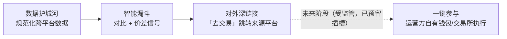

「去交易（Go trade）」在 v1 只是一个跳转到来源平台的深链接；架构精确预留了这个插槽，未来的
「一键参与」执行流程可以替换它而**无需重写**其余部分。每一个架构决策（适配器层、规范化 schema、
对外 API 网关）都是为了让后续阶段能够无痛接入执行能力。

### 1.3 范围

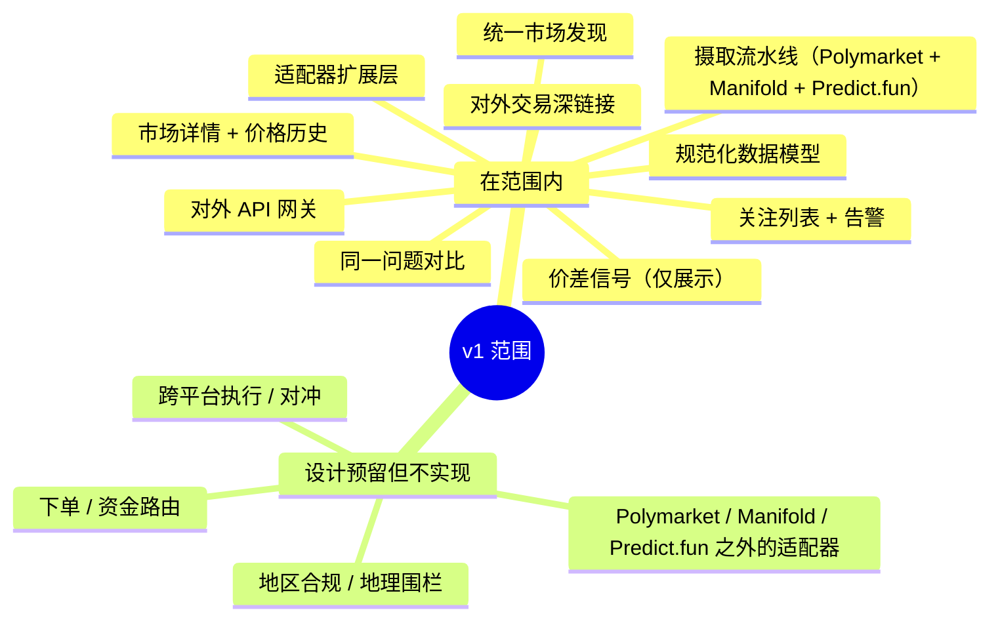

---

## 2. 系统上下文

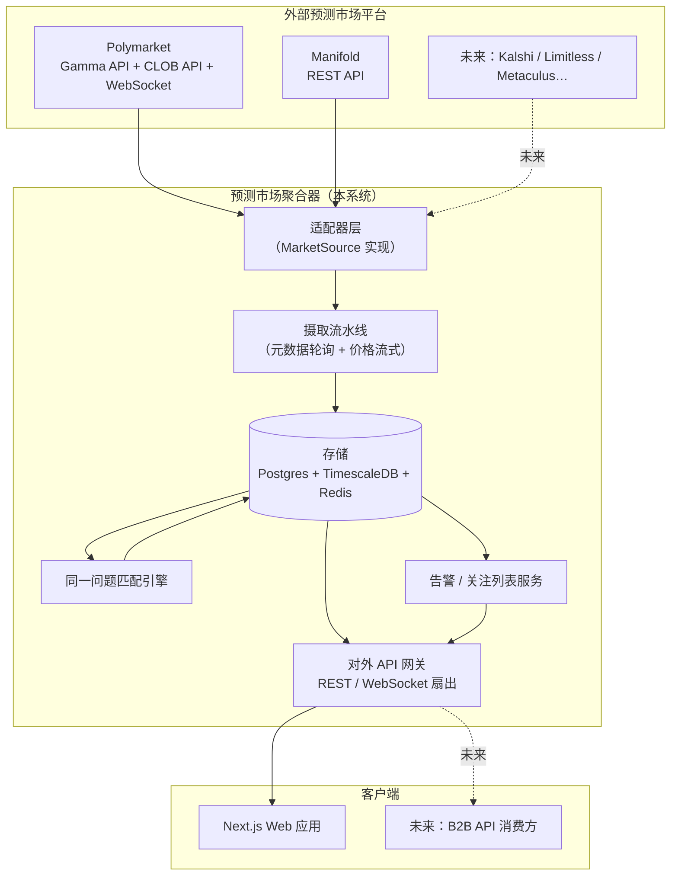

要点：

- 客户端**只**与本系统的 API 网关通信，绝不直接访问上游平台（需求 9.1）。
- 适配器层是唯一了解平台细节的地方；系统其余部分只认规范化模型。

---

## 3. 整体架构

### 3.1 分层架构（依赖规则）

依赖方向一律**指向内部的核心领域**。适配器层与 API 网关是可替换的「边缘」。

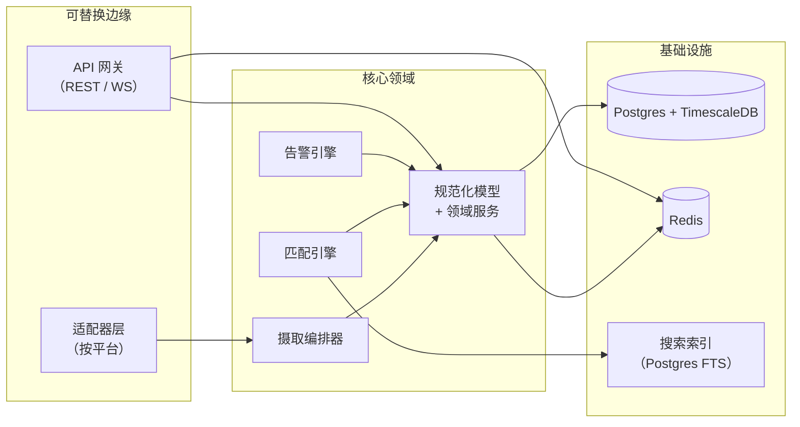

> **依赖规则：** `adapters/*` 与 `api/` 依赖 `core/`；`core/` 不依赖任何外部东西。这保证了
> 领域层的纯净，也使「接入一个平台」成为局部改动（只在 `adapters/` 下新增一个目录）。

### 3.2 monorepo 模块布局

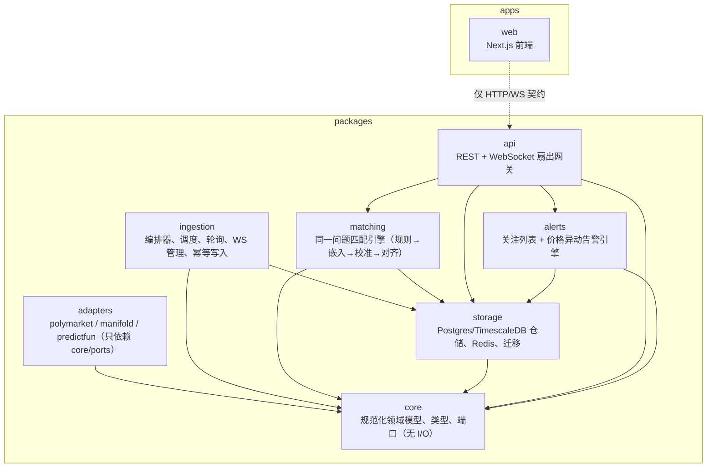

各包职责一览：

| 包           | 职责                                                                              |
| ------------ | --------------------------------------------------------------------------------- |
| `core`       | 规范化领域模型、类型、值对象、端口接口（无 I/O，依赖为零）                         |
| `adapters/*` | 把每个平台特有的关注点隔离到统一的 `MarketSource` 接口之后                         |
| `ingestion`  | 跨适配器编排轮询 + 流式订阅，幂等写入，限流/退避/重连回填                          |
| `matching`   | 把同一真实世界问题的市场分组到 `CanonicalEvent`，标记结算口径不一致                |
| `storage`    | Postgres 关系型元数据、TimescaleDB 价格超表、Redis 热缓存 + 发布/订阅             |
| `api`        | 系统自己的 REST + WebSocket 扇出，客户端唯一使用的接口                             |
| `alerts`     | 持久化关注列表/告警规则，评估规则并派发通知                                        |
| `apps/web`   | Next.js 前端，只与 API 网关通信                                                    |

---

## 4. 数据流

系统有两条主要的写入路径（元数据摄取、价格流式）和一条读取/推送路径（API 网关服务）。
下面分别用序列图描述。

### 4.1 元数据摄取（轮询 + 幂等写入）

编排器 `syncMarkets` 逐个适配器拉取市场元数据：用 keyset 分页游标拉一页 → 规范化 + 校验 →
按 `(source_id, external_id)` 幂等 upsert → **只有在一页被持久化之后**游标才前移，失败时游标
绝不回退（需求 7.1 / 属性 P1、P6）。

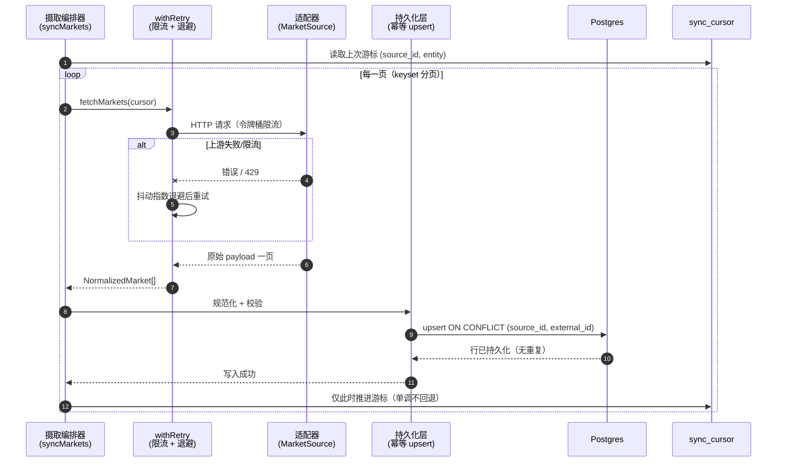

要点：

- **幂等性（P1）：** 重复同步同一上游状态会原地 upsert，不产生重复行、净变化为零。
- **游标单调性（P6）：** 游标只在一页**持久化成功后**前移，崩溃恢复时从上次成功点续传，绝不回退。
- **韧性：** `withRetry` 对每个 source 施加令牌桶限流 + 抖动指数退避，把上游的脆弱性隔离在边缘。

### 4.2 价格流式（WebSocket + 长尾轮询）

`classifyTier` 把市场分为活跃（active）与长尾（long-tail）。活跃市场在适配器声明
`websocketPrices` 能力时走 WebSocket 流式；长尾市场以较慢的节奏轮询（能力门禁见属性 P7）。

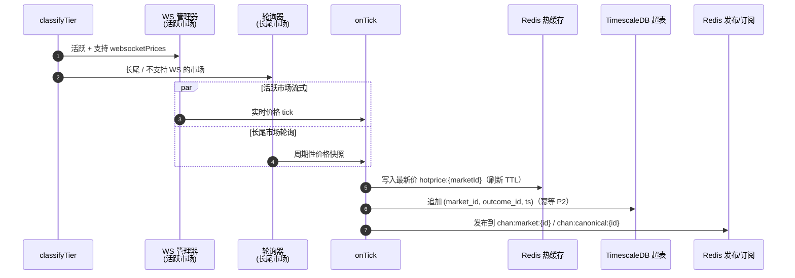

要点：

- **能力门禁（P7）：** 只有适配器声明 `websocketPrices` 才会建立 WS 订阅，否则降级为轮询。
- **价格写入幂等（P2）：** 超表主键 `(market_id, outcome_id, ts)` 让重叠的实时 tick 与回填点
  折叠为每键恰好一行。
- **热路径优化：** 最新价写入 Redis 热缓存（需求 10.4），API 服务最新价时无需触碰超表。

### 4.3 WebSocket 断线重连 + 缺口回填

WebSocket 掉线时，管理器以退避策略重连，并通过 `fetchPriceHistory` 回填断连期间的缺口，
保证价格曲线没有空洞。

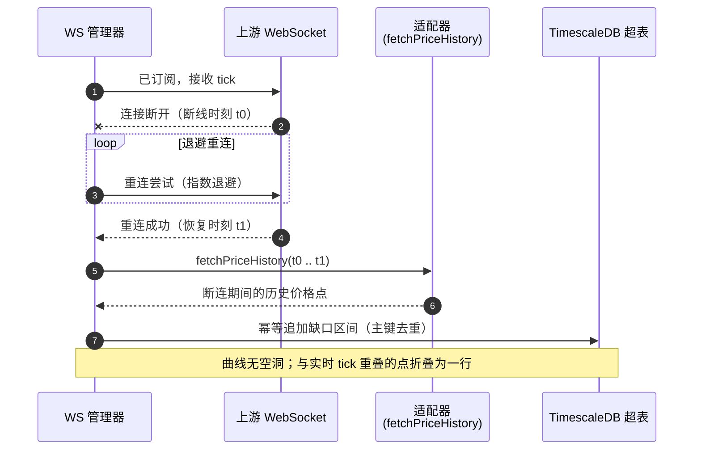

---

## 5. 同一问题匹配引擎

匹配引擎（`packages/matching`）把代表同一真实世界问题的市场分组到一个 `CanonicalEvent`。
它按「易→难」分层，每一层为下一层缩小候选集。**第 4 层（结算口径对齐）是任何配对进入价差信号
之前的强制门禁**——这是避免「假套利」（属性 P4）的关键。

### 5.1 四层匹配流水线

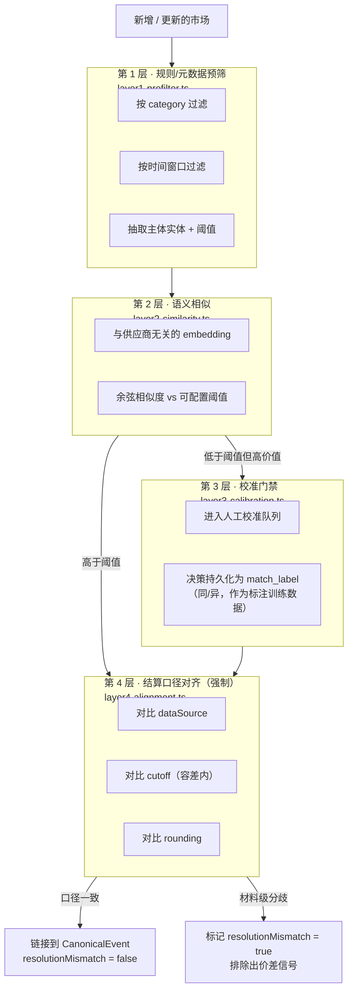

各层职责：

| 层 | 做什么                                                                 | 模块                    |
| -- | --------------------------------------------------------------------- | ----------------------- |
| 1  | 规则/元数据预筛：category、时间窗口、主体实体 + 阈值抽取                | `layer1-prefilter.ts`   |
| 2  | 语义相似：与供应商无关的 embedding + 余弦评分对比可配置阈值            | `layer2-similarity.ts`  |
| 3  | 校准门禁：低于阈值/高价值配对进人工队列，决策持久化为 `match_label`    | `layer3-calibration.ts` |
| 4  | 结算口径对齐：对比数据源、cutoff（容差内）、rounding；材料级分歧→标记  | `layer4-alignment.ts`   |

> **为什么第 4 层是强制的？** 两个市场即便措辞高度相似，如果结算口径不同（例如不同的数据源、
> 不同的截止时间、不同的取整规则），它们的概率就**不可直接比较**。强制对齐避免把口径不一致的
> 配对误判为套利机会（假套利，P4）。`ResolutionCriteria.raw` 始终保留，正是为了让第 4 层能够
> 检测这类分歧。

### 5.2 价差信号（computeSignals，仅展示）

`computeSignals`（`signals.ts`）按「最大跨平台隐含概率差」对 `CanonicalEvent` 排序，
**只统计 open、且非 resolutionMismatch 的市场**，并给每个信号打上 `executable: false`
（仅供展示，需求 3.3 / 属性 P5）。

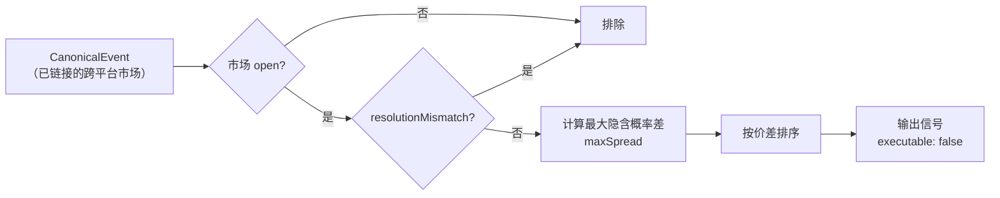

> **只读不变量（P5）：** 每个信号都携带 `executable: false`，v1 不存在任何下单/执行路径。
> 价差/套利输出**仅供参考**。「去交易」只是跳转来源平台的深链接。

### 5.3 对比对称性（P9）

A 对 B 的对比结果与 B 对 A 必须一致（对称）。这保证了无论用户从哪个平台进入对比视图，看到的
价差与口径一致性标记都相同（属性 P9，`comparison-symmetry.property.test.ts`）。

---

## 6. 数据模型

规范化 schema 是项目的核心资产，**与平台无关**：每个适配器把原始 payload 映射成这套实体，
匹配引擎、API 网关、前端因此永远不接触平台特有的形状。`(source_id, external_id)` 是被摄取
实体的通用幂等键。领域类型位于 `packages/core/src/model`（无 I/O 的包），与关系型 schema 一一对应。

### 6.1 实体关系图

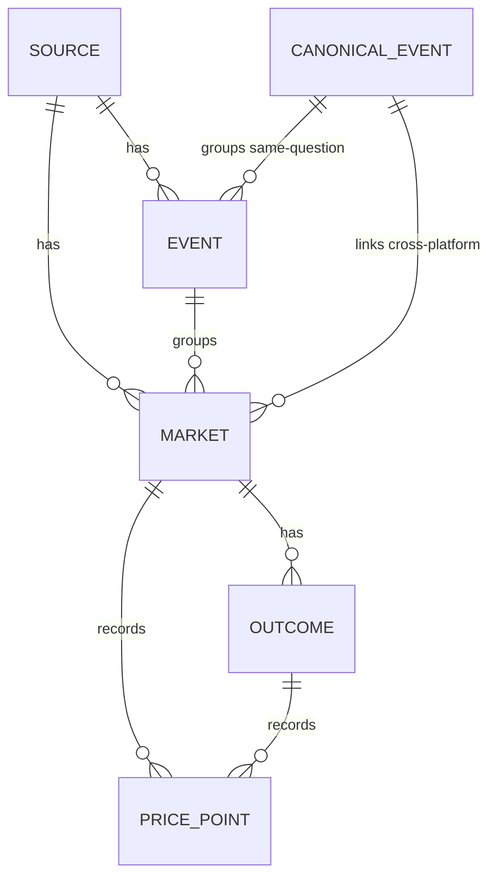

| 实体                 | 身份标识                      | 用途                                                                      |
| -------------------- | ----------------------------- | ------------------------------------------------------------------------- |
| `Source`             | `id` (UUID)                   | 已注册平台（`onchain` \| `cex` \| `regulated`）+ 基准货币                 |
| `Event`              | `(source_id, external_id)`    | 平台原生的相关市场分组                                                    |
| `Market`             | `(source_id, external_id)`    | 聚合的最小单元——单个问题                                                  |
| `Outcome`            | `(market_id, label)`          | 市场的一条腿（Yes/No/候选）含 `impliedProb` + `lastPrice`                 |
| `PricePoint`         | `(market_id, outcome_id, ts)` | 时间序列价格观测（TimescaleDB 超表行）                                    |
| `CanonicalEvent`     | `id` (UUID)                   | 链接同一真实世界问题的跨平台分组                                          |
| `ResolutionCriteria` | 内嵌于 `Market`               | 市场如何结算；`raw` 始终保留以备审计                                      |
| `Category`           | enum                          | `politics` \| `crypto` \| `sports` \| `economics` \| `tech` \| `other`   |

要点：

- 一个 `Market` 恰属于一个 `Source`，可选属于一个平台 `Event`，可选属于一个 `CanonicalEvent`
  （在匹配引擎跨平台链接它之前为 null）。
- `CanonicalEvent` 是对比视图与价差信号的基础：只有当两个或以上市场被链接（且结算口径对齐）后，
  才能计算跨平台价差。
- `category` 被**反规范化到 `market`** 上（除 `event` / `canonical_event` 外），使发现页筛选
  成为一次带索引的查找。

### 6.2 两个最关键的幂等键

```mermaid
flowchart TD
    subgraph META["元数据（event / market）"]
        M1["UNIQUE (source_id, external_id)"]
        M2["重复同步原地 upsert<br/>无重复行、净变化为零"]
        M1 --> M2
    end
    subgraph PRICE["价格（price_point）"]
        P1["PRIMARY KEY (market_id, outcome_id, ts)"]
        P2["重叠 tick + 重连回填点<br/>折叠为每键恰好一行"]
        P1 --> P2
    end
    META -. 需求 7.1 / P1 .-> R1["幂等摄取"]
    PRICE -. 需求 7.2 / P2 .-> R2["幂等价格写入"]
```

### 6.3 存储 schema

Postgres 持有关系型元数据；`price_point` 是 TimescaleDB 超表；Redis 持有最新价热缓存与
发布/订阅频道。SQL 位于 `packages/storage/migrations`，按字典序应用。

**`001_core.sql` — 核心关系型 + 时间序列 schema**（扩展：`pgcrypto`、`timescaledb`）

| 表                | 幂等键 / 主键                                | 关键列与约束                                                                                              |
| ----------------- | -------------------------------------------- | --------------------------------------------------------------------------------------------------------- |
| `source`          | `id` PK，`key` UNIQUE                         | `type CHECK (onchain\|cex\|regulated)`、`base_currency`                                                   |
| `canonical_event` | `id` PK                                       | `category CHECK`、`subject_entity`、`threshold_value`、`target_date`（第 1 层匹配输入）                  |
| `event`           | `id` PK，**`UNIQUE (source_id, external_id)`** | `canonical_event_id` FK（可空）、`category CHECK`、`end_date`                                             |
| `market`          | `id` PK，**`UNIQUE (source_id, external_id)`** | 反规范化 `category`、`status CHECK (open\|closed\|resolved)`、`spread CHECK (>=0)`、`resolution_criteria JSONB`、`resolution_mismatch`（第 4 层设置） |
| `outcome`         | `id` PK，`UNIQUE (market_id, label)`          | `token_id`（链上代币，链下为 null）、`implied_prob`/`last_price CHECK (BETWEEN 0 AND 1)`                  |
| `price_point`     | **`PRIMARY KEY (market_id, outcome_id, ts)`** | 超表（按 `ts`）；`price CHECK (BETWEEN 0 AND 1)`、`volume`                                                |
| `sync_cursor`     | `PRIMARY KEY (source_id, entity)`            | `entity CHECK (event\|market)`、不透明 `cursor`、`updated_at`（崩溃安全 keyset 续传）                     |
| `watchlist_item`  | `id` PK，`UNIQUE (user_id, target_type, target_id)` | `target_type CHECK (market\|canonicalEvent)`——防重复                                              |
| `alert_rule`      | `id` PK                                       | `rule_type CHECK (thresholdCross\|spreadWiden)`、`params JSONB`、`active`                                 |
| `match_label`     | `id` PK，`UNIQUE (market_a_id, market_b_id)`  | `decision CHECK (same\|different)`、`similarity CHECK (0..1)`、`labeled_by CHECK (human\|auto)`——校准训练数据 |

索引：`idx_market_canonical`（对比查找）、`idx_market_category_status`（发现页筛选）、
`idx_market_question_fts`（在 `to_tsvector('english', question)` 上的 GIN 全文检索索引）。

**TimescaleDB 超表：** `price_point` 通过 `create_hypertable('price_point', 'ts')` 转为超表，
得到按时间分区的存储与廉价的区间扫描（价格历史曲线）；`(market_id, outcome_id, ts)` 主键
保证写入幂等。

**`002_compliance_seams.sql` — 预留的未来阶段接缝（v1 不实现）：** 只**预留** schema 接缝，
v1 既不读取也不据此门禁（详见第 11 节）。`source.redistribution_policy JSONB`（按 source 的
数据再分发策略，仅记录）、`user_profile.region`（用户地区维度，预留但不解释）。

### 6.4 Redis：热缓存 + 发布/订阅

Redis 不做迁移（无 SQL），键方案定义在代码里。

- **最新价热缓存**（`hot-price-cache.ts`）：每个市场一个 Redis **hash**，键 `hotprice:{marketId}`，
  字段为 outcome 标签，值为 JSON `{ price, volume, ts }`。一次 `HGETALL` 一个往返读出市场所有
  outcome 价格；每次写入刷新短 TTL（默认 30s），活跃市场保持热、陈旧市场过期淘汰（需求 10.4）。
- **发布/订阅频道**（`channels.ts`，需求 9.2）：摄取侧发布，API 网关 `WS /ws` 转发给订阅客户端。

| 频道                  | 承载                          | 消息 `type` |
| --------------------- | ----------------------------- | ----------- |
| `chan:market:{id}`    | 单个市场的实时价格 tick       | `price`     |
| `chan:canonical:{id}` | 一个规范分组的实时价差更新     | `spread`    |
| `chan:alerts`         | 用户告警通知                  | `alert`     |

扇出消息信封保持三字段形状：`{ channel, type, payload }`，其中 `channel` 是完整 Redis 频道名
（可经 `parseChannel` 解回 kind + id）。

---

## 7. 对外 API 网关

对外网关（`packages/api`，基于 Fastify）是客户端**唯一**使用的接口。所有上游差异都隐藏在此，
限流也在这里统一（需求 9.1）。客户端绝不直接连接上游平台。

### 7.1 REST 端点

```text
GET  /api/markets                  发现（category / q / status 筛选，排序）
GET  /api/markets/:id              详情（元数据 + outcomes + 最新价）
GET  /api/markets/:id/history      价格历史时间序列（range, interval）
GET  /api/markets/:id/trade-link   对外来源深链接（仅导航）
GET  /api/sources                  已注册平台 + 能力
GET  /api/canonical-events         跨平台分组（可选 category）
GET  /api/canonical-events/:id     同一问题对比视图（含 mismatch 标记）
GET  /api/signals                  仅展示的价差信号（按价差排序）
GET  /healthz                      存活探针

# 用户级、需鉴权（仅当注入 store 时挂载）：
GET    /api/watchlist     POST /api/watchlist     DELETE /api/watchlist/:itemId
GET    /api/alerts        POST /api/alerts        DELETE /api/alerts/:alertId

WS   /ws                  Redis 发布/订阅驱动的扇出（market/canonical/alerts）
```

热路径的最新价由 Redis 热缓存提供。`trade-link` 端点返回 `{ url, executable: false }`，
正是可替换的未来「一键参与」插槽（见第 11 节）。

### 7.2 WebSocket 扇出协议

`WS /ws` 暴露 `market`、`canonical`、`alerts` 三个频道。它由摄取 `onTick` 路径（以及告警引擎）
经 Redis 发布/订阅喂入，因此客户端无需连接任何上游平台就能收到实时价格/价差/告警更新（需求 9.2）。
扇出仅在注入 Redis 订阅者工厂时挂载。

```mermaid
graph LR
    subgraph Ingest["摄取 / 告警"]
        TICK["onTick"]
        ALERTENG["告警引擎"]
    end
    subgraph RedisPS["Redis 发布/订阅"]
        CM["chan:market:{id}"]
        CC["chan:canonical:{id}"]
        CA["chan:alerts"]
    end
    subgraph Gateway["API 网关 WS /ws"]
        SUB["Redis 订阅者"]
        FAN["扇出转发"]
    end
    CLIENT["客户端（浏览器）"]

    TICK --> CM
    TICK --> CC
    ALERTENG --> CA
    CM --> SUB
    CC --> SUB
    CA --> SUB
    SUB --> FAN
    FAN -->|{ channel, type, payload }| CLIENT
```

### 7.3 网关加固（鉴权 + 限流）

- **统一限流（需求 9.3）：** 通过 `@fastify/rate-limit` 对每个客户端（IP）施加一条全局策略，
  覆盖所有公开读端点；超限返回 `429`，带标准 `x-ratelimit-*` / `retry-after` 头。存活探针豁免。
- **输入校验（需求 9.3）：** 每个端点在边缘用纯解析器解析 query/path 参数；`ValidationError`
  映射为 `400`。
- **鉴权（需求 9.4）：** 用户级资源（watchlist、alerts）通过 `requireAuth` preHandler 鉴权，
  背后是可注入的 `authenticate` 端口。**默认安全**：未配置鉴权器时，用户级路由**关闭**（`401`）；
  每个操作都限定到已鉴权的 `userId`，用户只能触碰自己的数据。

---

## 8. 告警 / 关注列表

`packages/alerts` 针对到来的价格/价差更新评估用户告警规则，并经网关 `alerts` WebSocket 频道
派发通知。支持两类规则：

- **`thresholdCross`：** 某市场的概率穿越阈值。
- **`spreadWiden`：** 某 canonical event 的价差扩大超过最小间隔。

关注列表与告警规则的持久化（含 watchlist 项防重复）位于 `packages/storage`。

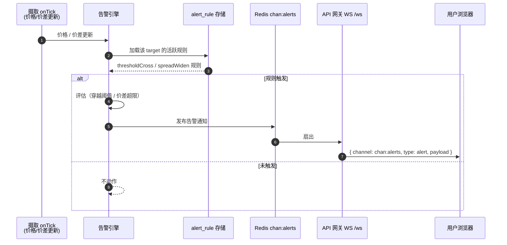

---

## 9. 前端（apps/web）

一个 Next.js（App Router）+ React 18 应用。它**只**通过单一类型化客户端
`apps/web/src/lib/api-client.ts`（经 `NEXT_PUBLIC_API_BASE_URL` 配置）与项目自己的 API 网关
通信，绝不连接上游平台（需求 9.1）。它在本地镜像网关的 DTO 形状（`apps/web/src/lib/dto.ts`），
因此唯一的耦合就是 HTTP 契约。

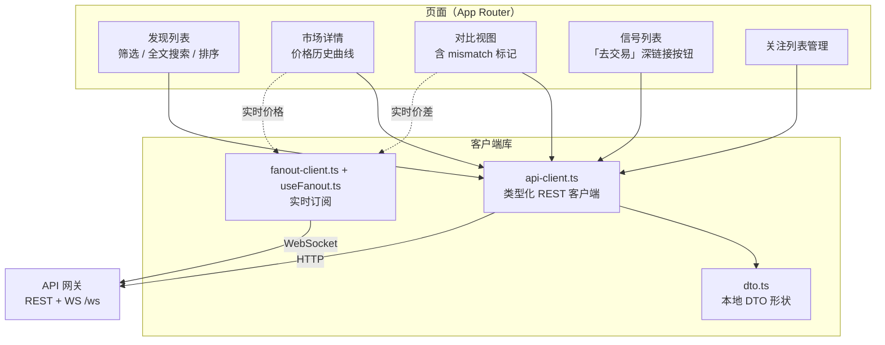

要点：

- 页面：发现列表（筛选、全文搜索、排序）、带价格历史曲线的市场详情、并排对比视图（含 mismatch
  标记）、仅展示的信号列表（带「去交易」深链接按钮）、关注列表管理。
- WebSocket 扇出客户端（`fanout-client.ts` + `useFanout.ts`）订阅实时价格/价差/告警更新。
- 前端刻意与后端的 `tsc --build` 项目引用图隔离（它需要 DOM/JSX/打包器解析）：单独用
  `npm run typecheck`（`tsc --noEmit`）做类型检查，用 `next build` 构建；测试经根
  `npm test` 的 `web` Vitest project（jsdom + Testing Library）运行。

---

## 10. 正确性属性（P1–P9）

设计声明了九条对所有合法输入都应成立的属性。其中八条用 [`fast-check`](https://fast-check.dev)
编码为**基于属性的测试（PBT）**；第九条（适配器隔离 P8）是由架构 + 能力门禁测试验证的结构性保证，
而非独立 PBT。每个属性测试在源码中都用 `**Validates: Requirements X.Y**` 注解链接回验收标准。
它们随 `npm test` 一起运行。

| #   | 属性                | 验证需求 | 编码于                                                        | 类型     |
| --- | ------------------- | -------- | ------------------------------------------------------------- | -------- |
| P1  | 幂等摄取            | 需求 7.1 | `storage/.../idempotent-ingestion.property.test.ts`          | PBT      |
| P2  | 幂等价格写入        | 需求 7.2 | `storage/.../idempotent-price-writes.property.test.ts`       | PBT      |
| P3  | 概率边界            | 需求 1.3 | `core/src/model/normalization.property.test.ts`             | PBT      |
| P4  | 无假套利            | 需求 3.2 | `matching/src/no-false-arbitrage.property.test.ts`          | PBT      |
| P5  | 仅展示不变量        | 需求 3.3 | `matching/src/display-only.property.test.ts`                | PBT      |
| P6  | 游标单调性          | 需求 7.3 | `ingestion/src/cursor-monotonicity.property.test.ts`        | PBT      |
| P7  | 能力门禁            | 需求 7.4 | `ingestion/src/capability-gating.property.test.ts`          | PBT      |
| P8  | 适配器隔离          | 需求 8.1 | 结构性（模块边界）+ 由 P7 能力门禁测试加强                    | 结构性   |
| P9  | 对比对称性          | 需求 2.2 | `matching/src/comparison-symmetry.property.test.ts`         | PBT      |

每条属性保证什么：

- **P1 幂等摄取：** 对同一上游状态重复同步，行数与内容不变：`upsert(m) ∘ upsert(m) ≡ upsert(m)`，
  以 `(source_id, external_id)` 为键。
- **P2 幂等价格写入：** 同一价格点写多次（如重连回填与实时 tick 重叠），每个
  `(market_id, outcome_id, ts)` 恰好一行，即便存在重复与乱序。
- **P3 概率边界：** 所有 outcome 满足 `0 ≤ impliedProb ≤ 1` 且 `0 ≤ lastPrice ≤ 1`；二元市场
  outcome 概率之和在容差 `ε` 内等于 1。
- **P4 无假套利：** 每个贡献价差信号的市场都 `resolutionMismatch = false`；口径不一致的配对
  绝不出现在 `/api/signals`，且少于两个对齐市场时无信号。
- **P5 仅展示不变量：** 返回的每个信号都 `executable === false`。该字段类型为字面量 `false`，
  连 `true` 都构造不出来（v1 无执行路径）。
- **P6 游标单调性：** 对给定 source，持久化游标跨成功同步绝不回退，且只在一页持久化后保存（崩溃安全续传）。
- **P7 能力门禁：** 只有 `capabilities().websocketPrices === true` 时才调用 `subscribePrices`；
  否则该市场由轮询服务且价格历史无缺失。
- **P8 适配器隔离：** 增删一个适配器只改动该适配器的模块；规范化模型、匹配引擎、API 契约不受影响。
  由依赖规则（`adapters/*` 与 `api/` 依赖 `core/`；`core/` 无依赖）与「一平台一目录」布局强制，
  并由能力门禁测试（P7）在运行时验证。
- **P9 对比对称性：** canonical event 成员关系对称（A 链接 B 则 B 链接 A），`maxSpread` 的计算
  与行序无关。

```bash
# 运行全部属性测试：
npx vitest run -t "Property"
# 或按文件，例如 no-false-arbitrage：
npx vitest run packages/matching/src/no-false-arbitrage.property.test.ts
```

---

## 11. 合规与未来阶段预留接缝

指导原则：v1 在结构上**只读**，每个未来的受监管能力都是一个**预留接缝**——已设计、但**不实现**
也**不可达**。下面的接缝都是惰性占位符，v1 没有任何代码读取或据此门禁。

### 11.1 v1 严格只读（需求 12.1）

v1 **不**暴露任何交易、下单、资金路由或执行能力：

- 系统不持有交易凭证，不开任何托管/执行代码路径——最大的一类风险（托管/执行）在结构上不存在。
- 价差/套利输出**仅供展示**：每个信号携带 `executable: false`，在 API 契约中强制。
- 唯一的对外动作是跳转来源平台的**导航**深链接。

### 11.2 三个预留接缝

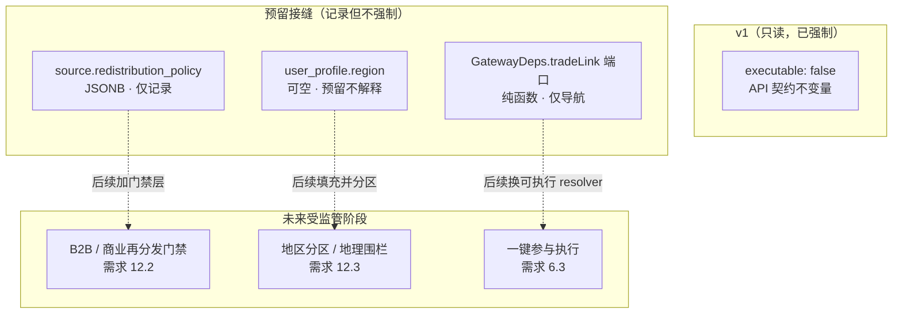

| 接缝                    | 位置                                | v1 状态                  | 预留给                       |
| ----------------------- | ----------------------------------- | ------------------------ | ---------------------------- |
| 只读不变量              | API 契约（`executable: false`）     | 已强制                   | —（需求 12.1）               |
| `redistribution_policy` | `source` 列（JSONB）                | 仅记录，从不门禁         | B2B/商业门禁（需求 12.2）    |
| 用户 `region`           | `user_profile.region`（可空）       | 预留，不解释             | 受监管地区分区（需求 12.3）  |
| trade-link resolver     | `GatewayDeps.tradeLink` 端口        | 仅导航，不可执行         | 一键参与（需求 6.3）         |

### 11.3 trade-link 接缝如何工作

- `GET /api/markets/{id}/trade-link` 返回 `{ url, executable: false }`。
- 处理器依赖注入的 `TradeLinkResolver` 端口（`GatewayDeps.tradeLink`）。默认基于注册表的
  resolver 位于 `packages/api/src/trade-link.ts`，是**纯函数**（无 I/O）：把市场存储的
  `(sourceKey, externalId, slug?)` 映射为公开来源 URL，并**始终**设 `executable: false`（需求 6.2、12.1）。
- 接入一个平台的深链接 = 在 resolver 注册表里加一个 builder 项。路由、处理器、DTO 永不改变。
- 未来「一键参与」流程通过 `GatewayDeps.tradeLink` 换入一个**不同的** resolver（例如返回由
  运营方自有钱包/交易所支撑的可执行动作）。因为发现、对比、信号都不依赖 trade-link resolver，
  这个替换**只**触碰被注入的 resolver，其余契约不受影响（需求 6.3）。

> 安全说明：本项目早期的 PBT 曾暴露 trade-link resolver 的一个原型污染漏洞（把 `__proto__`
> 当作 `sourceKey`）。已用 `Object.hasOwn` 守卫修复并加了回归测试。这印证了基于属性的测试在
> 发现真实安全缺陷上的价值。

---

## 12. 部署 / 本地运行

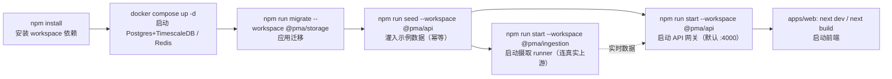

关键命令：

| 步骤       | 命令                                              | 说明                                                  |
| ---------- | ------------------------------------------------- | ----------------------------------------------------- |
| 安装       | `npm install`                                     | 安装 monorepo 全部 workspace 依赖                     |
| 数据存储   | `docker compose up -d`                            | 启动 Postgres + TimescaleDB、Redis（见 `docker-compose.yml`） |
| 迁移       | `npm run migrate --workspace @pma/storage`        | 按字典序应用 `packages/storage/migrations/*.sql`     |
| 种子数据   | `npm run seed --workspace @pma/api`               | 灌入演示用示例数据（幂等，可重复运行）               |
| 启动网关   | `npm run start --workspace @pma/api`              | 启动 API 网关，监听 `API_PORT`（默认 4000）          |
| 摄取 runner | `npm run start --workspace @pma/ingestion`       | 启动常驻摄取 runner：连真实上游，周期性同步元数据 + 流式/轮询价格 |
| 构建/测试  | `npm run build` / `npm run lint` / `npm test`     | 全量构建、lint、测试（含 P1–P9 属性测试）            |

连接串见 [`.env.example`](../../.env.example)（与 `docker-compose.yml` 默认值一致）。

> **演示鉴权：** 开发模式下 bearer token = `dev-token` 对应演示用户
> `00000000-0000-0000-0000-0000000000aa`，用于试用 watchlist / alerts 等用户级端点。
>
> **两种数据来源：**
>
> 1. **种子数据（默认演示）** —— `npm run seed --workspace @pma/api` 灌入一小份精选数据
>    （含把三平台 BTC 市场链接到同一 canonical event 的对比/信号），适合离线演示。
> 2. **真实数据（摄取 runner）** —— `npm run start --workspace @pma/ingestion`
>    （`packages/ingestion/src/main.ts`）注册三个适配器，周期性运行 `syncMarkets`
>    幂等拉取真实市场元数据，并按能力对活跃市场做 WebSocket 流式（Polymarket）或轮询
>    （Manifold / Predict.fun）价格，经 `onTick` 写入热缓存 + 超表 + 扇出。Polymarket 按
>    CLOB token id 计价、其余按市场 id 计价（见 `PriceIdStrategy`）。需要能出网的环境；
>    `REQUEST_TIMEOUT_MS` 保证上游不可达时快速失败而非挂起。
>
> 注：摄取 runner 目前不调用匹配引擎（`enqueueForMatching` 为 no-op），所以真实数据不会自动
> 形成跨平台 canonical event；跨平台对比/信号的演示仍以种子数据为准。

---

## 附：从需求到实现的整体映射

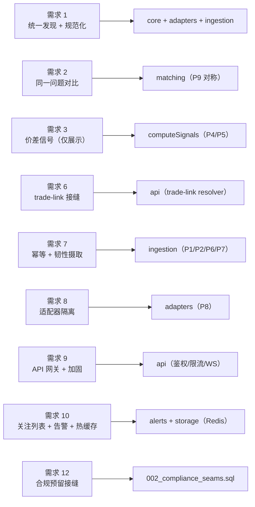

本文是「一站式」全景说明。分篇深入见 [中文文档索引](./README.md)；权威细节以代码与英文
[`design.md`](../../.kiro/specs/prediction-market-aggregator/design.md) 为准。
